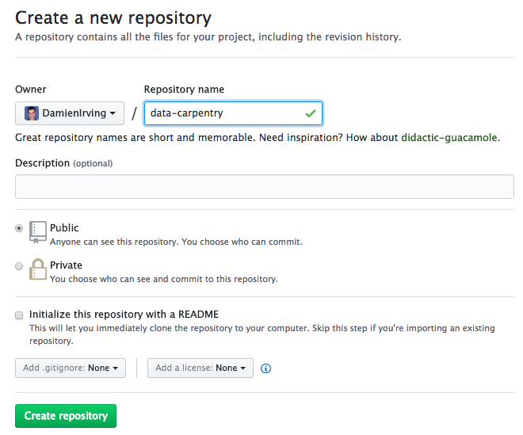
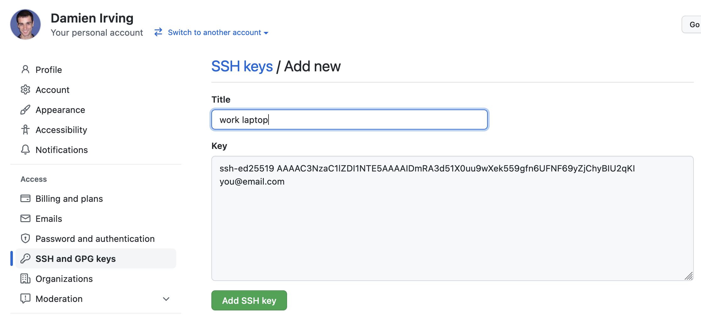
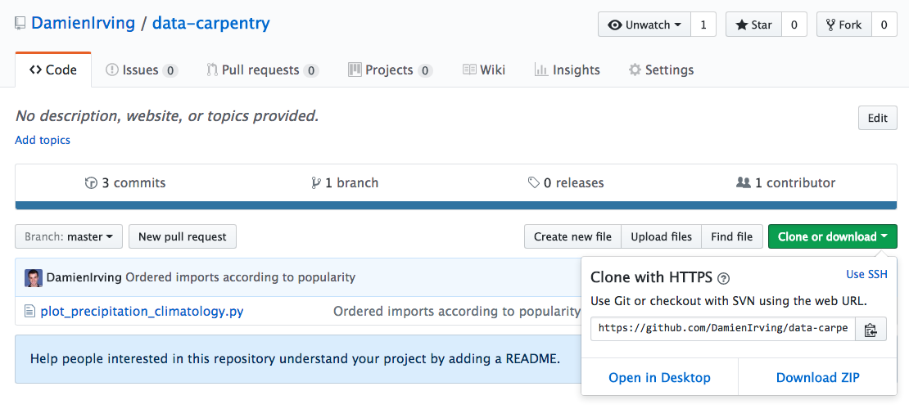

::::::::::::::::::::::::::::::::::::::: objectives

- Explain what remote repositories are and why they are useful.
- Push to or pull from a remote repository.

::::::::::::::::::::::::::::::::::::::::::::::::::

:::::::::::::::::::::::::::::::::::::::: questions

- How can I make my code available on GitHub?

::::::::::::::::::::::::::::::::::::::::::::::::::

:::::::::::::::::::::::::::::::::::::::  challenge

## Follow along

For this lesson participants follow along command by command,
rather than observing and then completing challenges afterwards.

::::::::::::::::::::::::::::::::::::::::::::::::::

## Creating a remote repository

Version control really comes into its own when we begin to collaborate with
other people (including ourselves for those who work on multiple computers).
We already have most of the machinery we need to do this; the
only thing missing is to copy changes from one repository to another.

Systems like Git allow us to move work between any two repositories. In
practice, though, it's easiest to use one copy as a central hub, and to keep it
on the web rather than on someone's laptop. Most programmers use hosting
services like [GitHub](https://github.com), [BitBucket](https://bitbucket.org) or
[GitLab](https://gitlab.com/) to hold those master copies.

Let's start by sharing the changes we've made to our current project with the
world. Log in to GitHub, then click on the icon in the top right corner to
create a new repository called `data-carpentry`:

{alt='Creating a Repository on GitHub (Step 1)'}

Name your repository "data-carpentry" and then click "Create Repository":

{alt='Creating a Repository on GitHub (Step 2)'}

As soon as the repository is created, GitHub displays a page with a URL and some
information on how to configure your local repository:

{alt='Creating a Repository on GitHub (Step 3)'}

This effectively does the following on GitHub's servers:

```bash
$ mkdir data-carpentry
$ cd data-carpentry
$ git init
```

Our local repository still contains our earlier work on `plot_precipitation_climatology.py`,
but the remote repository on GitHub doesn't contain any files yet.

The next step is to connect the two repositories. We do this by making the
GitHub repository a "remote" for the local repository.
The home page of the repository on GitHub includes the string we need to
identify it:

{alt='Where to Find Repository URL on GitHub'}

Click on the 'SSH' link to change the protocol from HTTPS to SSH if
SSH isn't already selected.

:::::::::::::::::::::::::::::::::::::::::  callout

## HTTPS vs. SSH

We use SSH here because, while it requires some additional configuration,
it is a security protocol widely used by many applications.
If you want to use HTTPS instead,
you'll need to create a [Personal Access Token](https://docs.github.com/en/authentication/keeping-your-account-and-data-secure/creating-a-personal-access-token).


::::::::::::::::::::::::::::::::::::::::::::::::::

Copy that location from the browser, go into the local `data-carpentry` repository,
and run this command:

```bash
$ git remote add origin git@github.com:DamienIrving/data-carpentry.git
```

Make sure to use the location for your repository rather than Damien's: the only
difference should be your username instead of `DamienIrving`.

We can check that the command has worked by running `git remote -v`:

```bash
$ git remote -v
```

```output
origin   git@github.com/DamienIrving/data-carpentry.git (push)
origin   git@github.com/DamienIrving/data-carpentry.git (fetch)
```

The name `origin` is a local nickname for your remote repository. We could use
something else if we wanted to, but `origin` is by far the most common choice.

## Connecting to GitHub with SSH

Before we can connect to our remote repository,
we need to set up a way for our computer to authenticate with GitHub
so it knows it's us trying to connect to our remote repository.

We are going to set up the method that is commonly used by many different services
to authenticate access on the command line.
This method is called Secure Shell Protocol (SSH).
SSH is a cryptographic network protocol that allows secure communication between computers
using an otherwise insecure network.

SSH uses what is called a key pair.
This is two keys that work together to validate access.
One key is publicly known and called the public key,
and the other key called the private key is kept private.
Very descriptive names.

You can think of the public key as a padlock,
and only you have the key (the private key) to open it.
You use the public key where you want a secure method of communication,
such as your GitHub account.
You give this padlock, or public key, to GitHub and say
"lock the communications to my account with this so that only computers
that have my private key can unlock communications and send git commands as my GitHub account."

What we will do now is the minimum required to set up the SSH keys
and add the public key to a GitHub account.

:::::::::::::::::::::::::::::::::::::::::  callout

## Keeping your keys secure

You shouldn't really forget about your SSH keys, since they keep your account secure.
It's good  practice to audit your secure shell keys every so often.
Especially if you are using multiple computers to access your account.


::::::::::::::::::::::::::::::::::::::::::::::::::

The first thing we are going to do is check if this has already been done on the computer we're on.
Because generally speaking, this setup only needs to happen once and then you can forget about it.
We can run the list command to check what key pairs already exist on our computer.

```bash
ls -al ~/.ssh
```

(Your output is going to look a little different depending on whether or not SSH
has ever been set up on the computer you are using.)

I have not set up SSH on my computer, so my output is

```output
ls: cannot access '/home/damien/.ssh': No such file or directory
```

If SSH has been set up on the computer you're using,
the public and private key pairs will be listed.
The file names are either `id_ed25519`/`id_ed25519.pub` or `id_rsa`/`id_rsa.pub`
depending on how the key pairs were set up.

If they don't exist on your computer, you can use this command to create them.

```bash
$ ssh-keygen -t ed25519 -C "you@email.com"
```

The `-t` option specifies which type of algorithm to use
and `-C` attaches a comment to the key (here, your email).

If you are using a legacy system that doesn't support the Ed25519 algorithm, use:  
`$ ssh-keygen -t rsa -b 4096 -C "you@email.com"`

```output
Generating public/private ed25519 key pair.
Enter file in which to save the key (/home/damien/.ssh/id_ed25519):
```

We want to use the default file, so just press <kbd>Enter</kbd>.

```output
Created directory '/home/damien/.ssh'.
Enter passphrase (empty for no passphrase):
```

Now, it is prompting us for a passphrase.
If you're using a laptop that other people sometimes have access to,
you might want to create a passphrase.
Be sure to use something memorable or save your passphrase somewhere,
as there is no "reset my password" option.

```output
Enter same passphrase again:
```

After entering the same passphrase a second time, we receive the confirmation.

```output
Your identification has been saved in /home/damien/.ssh/id_ed25519
Your public key has been saved in /home/damien/.ssh/id_ed25519.pub
The key fingerprint is:
SHA256:SMSPIStNyA00KPxuYu94KpZgRAYjgt9g4BA4kFy3g1o you@email.com
The key's randomart image is:
+--[ED25519 256]--+
|^B== o.          |
|%*=.*.+          |
|+=.E =.+         |
| .=.+.o..        |
|....  . S        |
|.+ o             |
|+ =              |
|.o.o             |
|oo+.             |
+----[SHA256]-----+
```

The "identification" is actually the private key.
You should never share it.
The public key is appropriately named.
The "key fingerprint"  is a shorter version of a public key.

Now that we have generated the SSH keys,
we will find the SSH files when we check.

```bash
ls -al ~/.ssh
```

```output
drwxr-xr-x 1 Damien  staff  197121   0 Jul 16 14:48 ./
drwxr-xr-x 1 Damien  staff  197121   0 Jul 16 14:48 ../
-rw-r--r-- 1 Damien  staff  197121 419 Jul 16 14:48 id_ed25519
-rw-r--r-- 1 Damien  staff  197121 106 Jul 16 14:48 id_ed25519.pub
```

Now we have a SSH key pair and we can run this command
to check if GitHub can read our authentication.

```bash
ssh -T git@github.com
```

```output
The authenticity of host 'github.com (192.30.255.112)' can't be established.
RSA key fingerprint is SHA256:nThbg6kXUpJWGl7E1IGOCspRomTxdCARLviKw6E5SY8.
This key is not known by any other names
Are you sure you want to continue connecting (yes/no/[fingerprint])? y
Please type 'yes', 'no' or the fingerprint: yes
Warning: Permanently added 'github.com' (RSA) to the list of known hosts.
git@github.com: Permission denied (publickey).
```

Right, we forgot that we need to give GitHub our public key!

First, we need to copy the public key.
Be sure to include the `.pub` at the end,
otherwise you're looking at the private key.

```bash
cat ~/.ssh/id_ed25519.pub
```

```output
ssh-ed25519 AAAAC3NzaC1lZDI1NTE5AAAAIDmRA3d51X0uu9wXek559gfn6UFNF69yZjChyBIU2qKI you@email.com
```

Now, going to GitHub.com,
click on your profile icon in the top right corner to get the drop-down menu.
Click "Settings," then on the settings page, click "SSH and GPG keys,"
on the left side "Account settings" menu.
Click the "New SSH key" button on the right side.
Now, you can add a title
(e.g. "work laptop" so you can remember where the original key pair files are located),
paste your SSH key into the field, and click the "Add SSH key" to complete the setup.

{alt='Adding SSH heys on GitHub'}

Now that we've set that up, let's check our authentication again from the command line.

```bash
$ ssh -T git@github.com
```

```output
Hi Damien! You've successfully authenticated, but GitHub does not provide shell access.
```

Good! This output confirms that the SSH key works as intended.
We are now ready to push our work to the remote repository.

```bash
$ git push origin main
```

```output
Counting objects: 9, done.
Delta compression using up to 4 threads.
Compressing objects: 100% (6/6), done.
Writing objects: 100% (9/9), 821 bytes, done.
Total 9 (delta 2), reused 0 (delta 0)
To github.com:DamienIrving/data-carpentry.git
 * [new branch]      master -> master
Branch master set up to track remote branch master from origin.
```

We can pull changes from the remote repository to the local one as well:

```bash
$ git pull origin main
```

```output
From github.com:DamienIrving/data-carpentry.git
 * branch            master     -> FETCH_HEAD
Already up-to-date.
```

Pulling has no effect in this case because the two repositories are already synchronised.
If someone else had pushed some changes to the repository on GitHub, though,
this command would download them to our local repository.

## Sharing code with yourself or others

If we logged onto a different computer
(e.g. a supercomputing facility or our desktop computer at home)
we could access a copy of our code by "cloning" it.

```bash
$ git clone git@github.com:DamienIrving/data-carpentry.git
```

Since our repository is public,
anyone (e.g. research collaborators) could clone the repository
by getting the location from the corresponding page on GitHub:

{alt='Cloning a repository on GitHub'}

:::::::::::::::::::::::::::::::::::::::::  callout

## Working with others

Someone who clones your repository can't push changes directly to it
(unless you add them as a collaborator).
They could, however, "fork" your repository and submit suggested changes via a "pull request".
Collaborators and pull requests are beyond the scope of this lesson,
but you may come across them as you get more experienced with
using git and GitHub.


::::::::::::::::::::::::::::::::::::::::::::::::::

:::::::::::::::::::::::::::::::::::::::: keypoints

- A local Git repository can be connected to one or more remote repositories.
- You can use the SSH protocol to connect to remote repositories.
- `git push` copies changes from a local repository to a remote repository.
- `git pull` copies changes from a remote repository to a local repository.

::::::::::::::::::::::::::::::::::::::::::::::::::


