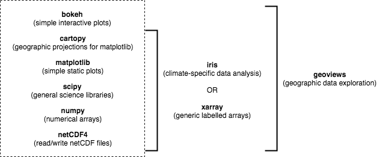

## Background

Until recently, the Python package installer (pip) only worked for libraries written in pure Python.
This was a major limitation for the data science community,
because many scientific Python libraries have C and/or Fortran dependencies.
To spare people the pain of installing these dependencies,
distributions like [Anaconda](https://www.anaconda.com/distribution/) and [Canopy](https://www.enthought.com/product/canopy/) have been released,
which come with the most popular data science libraries and their dependencies pre-installed.
These distributions also come with a package manager for installing libraries that weren’t pre-installed.
This tutorial focuses on [conda](https://conda.io/docs/),
which is the package manager associated with Anaconda (as we’ll see, it has some advantages over the Canopy package manager).

## Basic usage

According to the [latest documentation](https://docs.anaconda.com/anaconda/#anaconda-navigator-or-conda),
Anaconda comes with over 150 of the most widely used data science libraries (and their dependencies) pre-installed.
In addition, there are over 250 libraries available via the `conda install` command,
which can be executed at the command line (Mac, Linux) or Anaconda Prompt (Windows).
It is also possible to install packages using the Anaconda Navigator graphical user interface
(on any operating system).

For instance, the popular `xarray` library could be installed using the following command,
~~~
$ conda install xarray
~~~
{: .language-bash}

(Use `conda search -f {package_name}` to find out if a package you want is available.)

OR using Navigator:

> ## Miniconda
>
> If you don't want to install the entire Anaconda distribution,
> you can install [Miniconda](http://conda.pydata.org/miniconda.html) instead.
> It essentially comes with conda and nothing else.
>
{: .callout}

## Advanced usage

This is all great, but up until now Anaconda gives us nothing that Canopy doesn't.
The real advantage of Anaconda is the [Anaconda Cloud](https://anaconda.org) website,
where the community can contribute conda installation packages.
This is critical for the atmosphere and ocean science community,
because many of our libraries are discipline specific,
which means they'll never make it into the top 400 or so data science libraries
supported by Anaconda and Canopy.

You can search Anaconda Cloud to find the command needed to install the package.
For instance, here is the search result for the iris package:

As you can see, there are often multiple versions of the same package up on Anaconda Cloud.
To try and address this duplication problem, [conda-forge](https://conda-forge.github.io/) has been launched,
which aims to be a central repository that contains just a single (working) version of each package on Anaconda Cloud.
You can therefore expand the selection of packages available via `conda install` beyond the chosen 400
by adding the conda-forge channel:
~~~
$ conda config --add channels conda-forge
~~~
{: .language-bash}

OR

We recommned not adding any other third-party channels unless absolutely necessary,
because mixing packages from multiple channels can cause headaches like binary incompatibilities.

### The PyAOS stack

For reading, writing and analysing netCDF data,
atmosphere and ocean scientists will typically do most of their work with either the [iris](http://scitools.org.uk/iris/)
or [xarray](http://xarray.pydata.org/en/stable/) library.
These libraries are built on top of more generic data science libraries like numpy and matplotlib,
to make the types of analysis we do faster and more efficient.
To learn more about the PyAOS "stack" shown in the diagram below
(i.e. the collection of libraries that are typically used for
data analysis and visualisation in the atmosphere and ocean sciences),
check out [this post](https://drclimate.wordpress.com/2016/10/04/the-weatherclimate-python-stack/).

 

For this particular lesson we will use iris,
but all the same tasks could be performed with xarray.
We'll also install
[jupyter](https://jupyter.org/) (so we can use the jupyter notebook)
and [cmocean](http://matplotlib.org/cmocean/) (for nice color palettes).  

We could install these libraries from Anaconda Navigator (not shown)
or at the command line (Mac, Linux) / Anaconda Prompt (Windows):
~~~
$ conda install jupyter iris cmocean
~~~
{: .language-bash}

If we then list all the libraries that we've got installed,
we can see that jupyter, iris and cmocean (and their dependencies)
are now there:
~~~
$ conda list
~~~
{: .language-bash}

(This list can also be viewed in the environments tab of the Navigator.)

> ## Creating separate environments
>
> If you've got multiple data science projects on the go,
> installing all your packages in the same conda environment can get a little messy.
> (By default they are installed in the root/base environment.)
> It's therefore common practice to create separate environments
> for the various projects you're working on.
>
> For instance, we could create an environment called `pyaos-lesson` for this lesson.
> The process of creating a new environment can be managed in the environments tab
> of the Navigator or via the following commands:
>
> ~~~
> $ conda create -n pyaos-lesson jupyter iris cmocean
> $ source activate pyaos-lesson
> ~~~
> {: .language-bash}
>
> (it's `source deactivate` to exit)
>
> You can have lots of different environments,
>
> ~~~
> $ conda info --envs
> ~~~
> {: .language-bash}
>
> and you can export them (to a YAML configuration file) for others to use:
>
> ~~~
> $ conda env export -n pyaos-lesson -f pyaos-lesson
> ~~~
> {: .language-bash}
>
> You can then upload the environment to your account at Anaconda Cloud,
>
> ~~~
> $ conda env upload -f pyaos-lesson
> ~~~
> {: .language-bash}
>
> so that others can re-create your environment as follows:
> 
> ~~~
> $ conda env create damienirving/pyaos-lesson
> $ source activate pyaos-lesson
> ~~~
>
> To delete the environment:
>
> ~~~
> $ conda env remove -n pyaos-lesson
> ~~~
> {: .language-bash}
{: .callout}

> ## Install the libraries required for this lesson
>
> Go ahead and install jupyter, iris and cmocean using either the Anaconda Navigator interface
> or the command line (Mac, Linux) / Anaconda Prompt (Windows). 
> 
> (Those using Mac or Linux may like to create a separate `pyaos-lesson` environment,
> but this is not necessary.
> Windows users shouldn't create a separate environment,
> because it's not possible to activate environments from the Git Bash terminal emulator,
> which is something we'll do in later lessons.)
>
{: .challenge}
