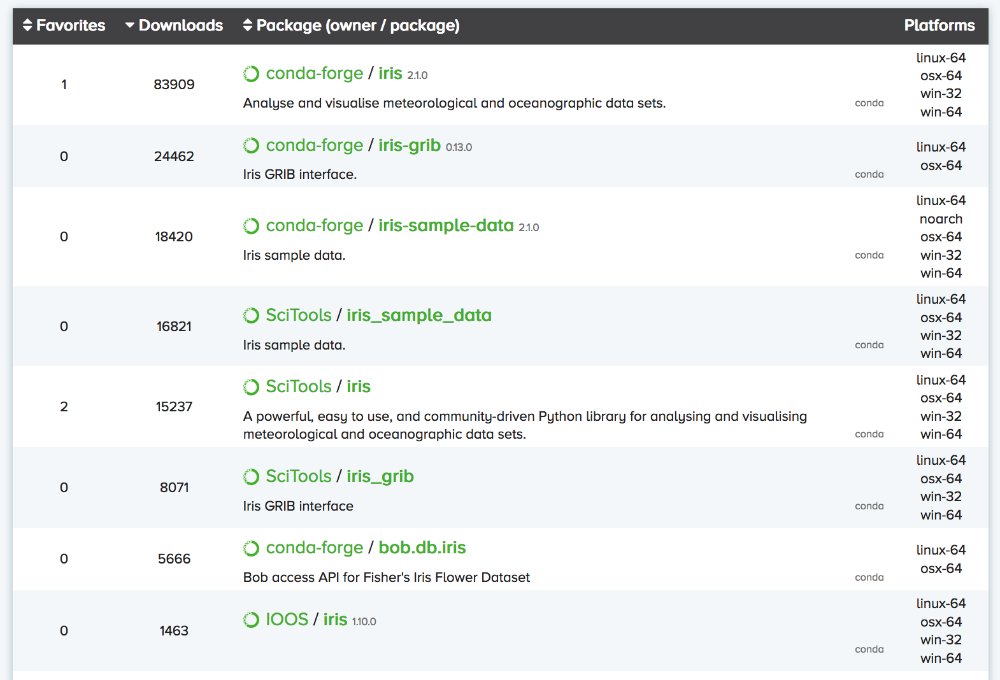

## Background

Until recently, the Python package installer (pip) only worked for libraries written in pure Python.
This was a major limitation for the data science community,
because many scientific Python libraries have C and/or Fortran dependencies.
To spare people the pain of installing these dependencies,
distributions like [Anaconda](https://www.anaconda.com/distribution/) and [Canopy](https://www.enthought.com/product/canopy/) have been released,
which come with the most popular data science libraries and their dependencies pre-installed.
These distributions also come with a package manager for installing libraries that weren’t pre-installed.
This tutorial focuses on [conda](https://conda.io/docs/),
which is the package manager associated with Anaconda (as we’ll see, it has some advantages over the Canopy package manager).

## Basic usage

According to the [latest documentation](https://docs.anaconda.com/anaconda/#anaconda-navigator-or-conda),
Anaconda comes with over 150 of the most widely used data science libraries (and their dependencies).

In addition, there are over 250 libraries available via `conda install`,
which can be installed via the Anaconda Navigator graphical user interface or at the command line.
For instance, installing the popular `xarray` library can be achieved
by simply entering the following at the command line:
~~~
$ conda install xarray
~~~
{: .language-bash}

You can use `conda search -f {package_name}` (or the Navigator)
to find out if the package you want is available.

> ## Miniconda
>
> If you don't want to install the entire Anaconda distribution,
> you can install [Miniconda](http://conda.pydata.org/miniconda.html) instead.
> It essentially comes with conda and nothing else.
>
{: .callout}

## Advanced usage

This is all great, but up until now Anaconda gives us nothing that Canopy doesn't.
The real advantage of Anaconda is the [Anaconda Cloud](https://anaconda.org) website,
where the community can contribute conda installation packages.
This is critical for the atmosphere and ocean science community,
because many of our libraries are discipline specific,
which means they'll never make it into the top 400 or so data science libraries
supported by Anaconda and Canopy.

You can search Anaconda Cloud
to find the command line entry needed to install the package.
For instance, here is the search result for the iris package:

The problem here is that there are often multiple versions of the same package up on Anaconda Cloud.
To try and address this duplication problem, [conda-forge](https://conda-forge.github.io/) has been launched,
which aims to be a central repository that contains just a single (working) version of each package on Anaconda Cloud.
You can therefore expand the selection of packages available via `conda install` beyond the chosen 400
by adding the conda-forge channel:
~~~
$ conda config --add channels conda-forge
~~~
{: .language-bash}

We recommned not adding any other third-party channels unless absolutely necessary,
because mixing packages from multiple channels can cause headaches like binary incompatibilities.

### Environments

Now we can go ahead and use conda to install the libraries we need for this lesson.
Rather than install everything in the same place
(which can get unwieldy if you've got multiple data science projects on the go)
it's common practice to create separate environments
for the various projects you're working on.

Let's call this environment `pyaos-lesson`
and include the following Python libraries:

* [jupyter](https://jupyter.org/) - so we can use the jupyter notebook  
* [iris](http://scitools.org.uk/iris/) - for handling our CMIP5 data  
* [cmocean](http://matplotlib.org/cmocean/) - for nice color palettes  
* [cmdline_provenance](http://cmdline-provenance.readthedocs.io/en/latest/) - to record our data processing steps

Since conda can handle non-Python packages,
we will also install the following command line tools:

* [NCO](http://nco.sourceforge.net/) - for editing the attributes of netCDF files  
* [CDO](https://code.mpimet.mpg.de/projects/cdo/) - for performing basic climate calculations on netCDF files

~~~
$ conda create -n pyaos-lesson jupyter iris cmocean cmdline-provenance nco cdo
$ source activate pyaos-lesson
~~~
{: .language-bash}

> ## Create your own environment
>
> Go ahead and create your own `pyaos-lesson` environment to use in this workshop:
> ~~~
> $ conda config --add channels conda-forge
> $ conda create -n pyaos-lesson jupyter iris cmocean cmdline-provenance nco cdo
> $ source activate pyaos-lesson
> ~~~
> {: .language-bash}
> (Note that CDO is not available on Windows.)
>
{: .challenge}

If we list all the libraries in this new environment,
we can see that jupyter, iris, cmocean, cmdline-provenance, nco and cdo
and all their required dependencies have been installed:

~~~
$ conda list
~~~
{: .language-bash}

(it's `source deactivate` to exit)

You can have lots of different environments:

~~~
$ conda info --envs
~~~
{: .language-bash}

and you can export them (to a YAML configuration file) for others to use:

~~~
$ conda env export -n pyaos-lesson -f pyaos-lesson
~~~
{: .language-bash}

You can then upload the environment to your account at Anaconda Cloud:

~~~
$ conda env upload -f pyaos-lesson
~~~
{: .language-bash}

so that others can re-create your environment as follows:

~~~
$ conda env create damienirving/pyaos-lesson
$ source activate pyaos-lesson
~~~

> ## Deleting things
>
> To delete an environment:
> ~~~
> $ conda env remove -n pyaos-lesson
> ~~~
> {: .language-bash}
> To delete Anaconda, just find the Anaconda folder on your system and delete it.
{: .callout}

> ## conda kapsel
>
> To make the management and sharing of environments even easier,
> [conda kapsel](https://www.continuum.io/blog/developer-blog/automate-your-readme-conda-kapsel-beta-1)
> has been released.
>
{: .callout}
