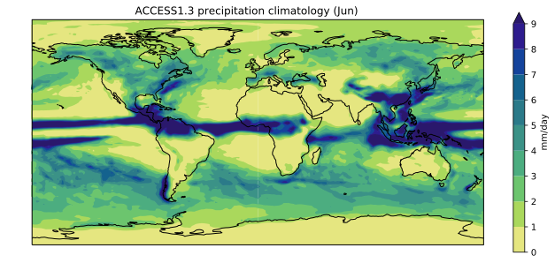
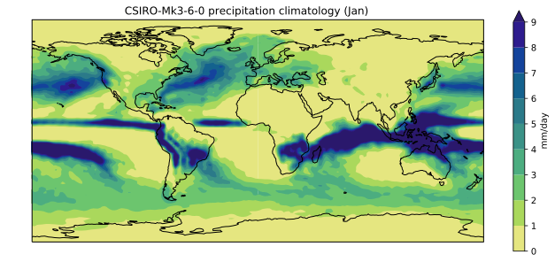

In the previous lesson
we created a plot of the ACCESS1-3 historical precipitation climatology
using the following commands:

~~~
import iris
import matplotlib.pyplot as plt
import iris.plot as iplt
import iris.coord_categorisation
import cmocean
import numpy

access_pr_file = 'data/pr_Amon_ACCESS1-3_historical_r1i1p1_200101-200512.nc'

cube = iris.load_cube(access_pr_file, 'precipitation_flux')
iris.coord_categorisation.add_month(cube, 'time')
cube = cube.extract(iris.Constraint(month='Jun'))

cube.data = cube.data * 86400
cube.units = 'mm/day'

clim = cube.collapsed('time', iris.analysis.MEAN)

fig = plt.figure(figsize=[12,5])
iplt.contourf(clim, cmap=cmocean.cm.haline_r, 
              levels=numpy.arange(0, 10), extend='max')
plt.gca().coastlines()
cbar = plt.colorbar()
cbar.set_label(str(cube.units))

title = '%s precipitation climatology (Jun)' %(cube.attributes['model_id'])
plt.title(title)

plt.show()
~~~
{: .language-python}

If we wanted to create a similar plot for a different model and/or different month,
we could cut and paste the code and edit accordingly.
The problem with that (common) approach is that it increases the chances of a making a mistake.
If we manually updated the month to 'Mar' for the `cube.extract` command
but forgot to update it when calling `plt.title`, for instance,
we'd have a mismatch between the data and title. 

The cut and paste approach is also much more time consuming.
If we think of a better way to create this plot in future
(e.g. we might want to add gridlines using `plt.gca().gridlines()`),
then we have to find and update every copy and pasted instance of the code.

A better approach is to put the code in a function.
The code itself then remains untouched,
and we simply call the function with different input arguments.

~~~
def plot_pr_climatology(pr_file, month, gridlines=False):
    """Plot the precipitation climatology.
    
    Args:
      pr_file (str): Precipitation data file
      month (str): Month (3 letter abbreviation, e.g. Jun)
      gridlines (bool): Select whether to plot gridlines
    
    """

    cube = iris.load_cube(pr_file, 'precipitation_flux')
    iris.coord_categorisation.add_month(cube, 'time')
    cube = cube.extract(iris.Constraint(month=month))

    cube.data = cube.data * 86400
    cube.units = 'mm/day'

    clim = cube.collapsed('time', iris.analysis.MEAN)

    fig = plt.figure(figsize=[12,5])
    iplt.contourf(clim, cmap=cmocean.cm.haline_r, 
                  levels=numpy.arange(0, 10),
                  extend='max')
    plt.gca().coastlines()
    if gridlines:
        plt.gca().gridlines()
    cbar = plt.colorbar()
    cbar.set_label(str(cube.units))

    title = '%s precipitation climatology (%s)' %(cube.attributes['model_id'], month)
    plt.title(title)
~~~
{: .language-python}

The docstring allows us to have good documentation for our function:

~~~
help(plot_pr_climatology)
~~~
{: .language-python}

~~~
Help on function plot_pr_climatology in module __main__:

plot_pr_climatology(pr_file, month, gridlines=False)
    Plot the precipitation climatology.
    
    Args:
      pr_file (str): Precipitation data file
      month (str): Month (3 letter abbreviation, e.g. Jun)
      gridlines (bool): Select whether to plot gridlines
~~~
{: .output}

We can now use this function to create exactly the same plot as before:

~~~
plot_pr_climatology('data/pr_Amon_ACCESS1-3_historical_r1i1p1_200101-200512.nc', 'Jun')
plt.show()
~~~

Plot a different model and month:

~~~
plot_pr_climatology('data/pr_Amon_CSIRO-Mk3-6-0_historical_r1i1p1_200101-200512.nc', 'Jan')
plt.show()
~~~
{: .language-python}

Or use the optional `gridlines` input argument
to change the default behaviour of the function
(keyword arguments are usually used for options
that the user will only want to change occasionally):

~~~
plot_pr_climatology('data/pr_Amon_CSIRO-Mk3-6-0_historical_r1i1p1_200101-200512.nc',
                    'Jan', gridlines=True)
plt.show()
~~~
{: .language-python}

Our function now works, but at 16 lines of code it's starting to get a little long.
In general, people can only fit around 7-12 pieces of information in their short term memory.
The readability of your code can therefore be greatly enhanced
by keeping your functions short and sharp.
The speed at which people can analyse their data is usually limited
by the time it takes to read/understand/edit their code
(as opposed to the time it takes the code to actually run),
so the frequent use of short,
well documented functions can dramatically speed up your data science.

> ## Functions
>
> Break the contents of `plot_pr_climatology()` into a series of small functions,
> such that it reads as follows:
>
> ~~~
> def plot_pr_climatology(pr_file, month, gridlines=False):
>     """Plot the precipitation climatology.
>    
>     Args:
>       pr_file (str): Precipitation data file
>       month (str): Month (3 letter abbreviation, e.g. Jun)
>       gridlines (bool): Select whether to plot gridlines
>    
>     """
>
>     cube = read_data(pr_file, month)    
>     cube = convert_pr_units(cube)
>     clim = cube.collapsed('time', iris.analysis.MEAN)
>     plot_data(clim, month, gridlines)
> ~~~
> {: .language-python}
>
> In other words, you'll need to define new `read_data()`,
> `convert_pr_units()` and `plot_data()`
> functions using code from the existing `plot_pr_climatology()` function.
>
> > ## Solution
> > ~~~
> > def read_data(fname, month):
> >     """Read an input data file"""
> >    
> >     cube = iris.load_cube(fname, 'precipitation_flux')
> >    
> >     iris.coord_categorisation.add_month(cube, 'time')
> >     cube = cube.extract(iris.Constraint(month=month))
> >    
> >     return cube
> >
> >
> > def convert_pr_units(cube):
> >     """Convert kg m-2 s-1 to mm day-1"""
> >    
> >     cube.data = cube.data * 86400
> >     cube.units = 'mm/day'
> >    
> >     return cube
> >
> >
> > def plot_data(cube, month, gridlines=False):
> >     """Plot the data."""
> >        
> >     fig = plt.figure(figsize=[12,5])    
> >     iplt.contourf(cube, cmap=cmocean.cm.haline_r, 
> >                   levels=numpy.arange(0, 10),
> >                   extend='max')
> >
> >     plt.gca().coastlines()
> >     if gridlines:
> >         plt.gca().gridlines()
> >     cbar = plt.colorbar()
> >     cbar.set_label(str(cube.units))
> >    
> >     title = '%s precipitation climatology (%s)' %(cube.attributes['model_id'], month)
> >     plt.title(title)
> >
> >
> > def plot_pr_climatology(pr_file, month, gridlines=False):
> >     """Plot the precipitation climatology.
> >   
> >     Args:
> >       pr_file (str): Precipitation data file
> >       month (str): Month (3 letter abbreviation, e.g. Jun)
> >       cmap: matplotlib colormap
> >   
> >     """
> >
> >     cube = read_data(pr_file, month)    
> >     cube = convert_pr_units(cube)
> >     clim = cube.collapsed('time', iris.analysis.MEAN)
> >     plot_data(clim, month, gridlines)
> > ~~~
> > {: .language-python}
> {: .solution}
{: .challenge} 
