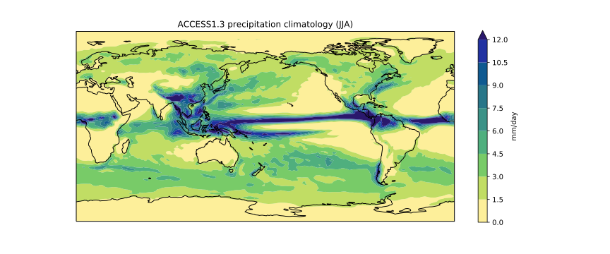
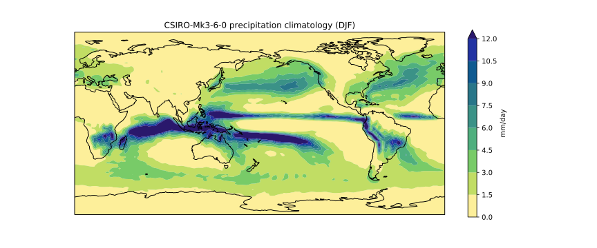
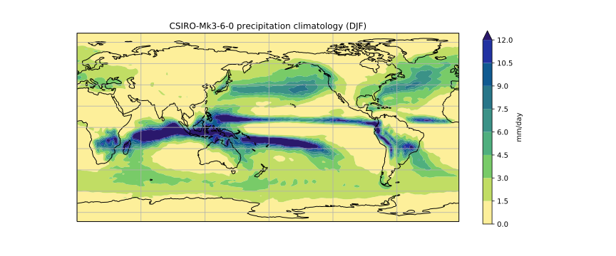

In the previous lesson
we created a plot of the ACCESS1-3 historical precipitation climatology
using the following commands:

~~~
import xarray as xr
import matplotlib.pyplot as plt
import cartopy.crs as ccrs
import numpy as np
import cmocean

access_pr_file = 'data/pr_Amon_ACCESS1-3_historical_r1i1p1_200101-200512.nc'

dset = xr.open_dataset(access_pr_file)

clim = dset['pr'].groupby('time.season').mean('time', keep_attrs=True)

clim.data = clim.data * 86400
clim.attrs['units'] = 'mm/day'

fig = plt.figure(figsize=[12,5])
ax = fig.add_subplot(111, projection=ccrs.PlateCarree(central_longitude=180))
clim.sel(season='JJA').plot.contourf(ax=ax,
                                     levels=np.arange(0, 13.5, 1.5),
                                     extend='max',
                                     transform=ccrs.PlateCarree(),
                                     cbar_kwargs={'label': clim.units},
                                     cmap=cmocean.cm.haline_r)
ax.coastlines()

title = '%s precipitation climatology (JJA)' %(dset.attrs['model_id'])
plt.title(title)

plt.show()
~~~
{: .language-python}

If we wanted to create a similar plot for a different model and/or different month,
we could cut and paste the code and edit accordingly.
The problem with that (common) approach is that it increases the chances of a making a mistake.
If we manually updated the season to 'DJF' for the `clim.sel(season=` command
but forgot to update it when calling `plt.title`, for instance,
we'd have a mismatch between the data and title. 

The cut and paste approach is also much more time consuming.
If we think of a better way to create this plot in future
(e.g. we might want to add gridlines using `plt.gca().gridlines()`),
then we have to find and update every copy and pasted instance of the code.

A better approach is to put the code in a function.
The code itself then remains untouched,
and we simply call the function with different input arguments.

~~~
def plot_pr_climatology(pr_file, season, gridlines=False):
    """Plot the precipitation climatology.
    
    Args:
      pr_file (str): Precipitation data file
      season (str): Season (3 letter abbreviation, e.g. JJA)
      gridlines (bool): Select whether to plot gridlines
    
    """

    dset = xr.open_dataset(pr_file)

    clim = dset['pr'].groupby('time.season').mean('time', keep_attrs=True)

    clim.data = clim.data * 86400
    clim.attrs['units'] = 'mm/day'

    fig = plt.figure(figsize=[12,5])
    ax = fig.add_subplot(111, projection=ccrs.PlateCarree(central_longitude=180))
    clim.sel(season=season).plot.contourf(ax=ax,
                                          levels=np.arange(0, 13.5, 1.5),
                                          extend='max',
                                          transform=ccrs.PlateCarree(),
                                          cbar_kwargs={'label': clim.units},
                                          cmap=cmocean.cm.haline_r)
    ax.coastlines()
    if gridlines:
        plt.gca().gridlines()
    
    title = '%s precipitation climatology (%s)' %(dset.attrs['model_id'], season)
    plt.title(title)
~~~
{: .language-python}

The docstring allows us to have good documentation for our function:

~~~
help(plot_pr_climatology)
~~~
{: .language-python}

~~~
Help on function plot_pr_climatology in module __main__:

plot_pr_climatology(pr_file, season, gridlines=False)
    Plot the precipitation climatology.
    
    Args:
      pr_file (str): Precipitation data file
      season (str): Season (3 letter abbreviation, e.g. JJA)
      gridlines (bool): Select whether to plot gridlines
~~~
{: .output}

We can now use this function to create exactly the same plot as before:

~~~
plot_pr_climatology('data/pr_Amon_ACCESS1-3_historical_r1i1p1_200101-200512.nc', 'JJA')
plt.show()
~~~
{: .language-python}

Plot a different model and season:

~~~
plot_pr_climatology('data/pr_Amon_CSIRO-Mk3-6-0_historical_r1i1p1_200101-200512.nc', 'DJF')
plt.show()
~~~
{: .language-python}

Or use the optional `gridlines` input argument
to change the default behaviour of the function
(keyword arguments are usually used for options
that the user will only want to change occasionally):

~~~
plot_pr_climatology('data/pr_Amon_CSIRO-Mk3-6-0_historical_r1i1p1_200101-200512.nc',
                    'DJF', gridlines=True)
plt.show()
~~~
{: .language-python}

> ## Short functions
>
> Our `plot_pr_climatology` function works, but at 16 lines of code it's starting to get a little long.
> In general, people can only fit around 7-12 pieces of information in their short term memory.
> The readability of your code can therefore be greatly enhanced
> by keeping your functions short and sharp.
> The speed at which people can analyse their data is usually limited
> by the time it takes to read/understand/edit their code
> (as opposed to the time it takes the code to actually run),
> so the frequent use of short,
> well documented functions can dramatically speed up your data science.
>
> 1. Cut and paste the `plot_pr_climatology` function (defined in the notes above) into your own notebook and try running it with different input arguments. 
> 2. Break the contents of `plot_pr_climatology` down into a series of smaller functions, such that it reads as follows:
>
> ~~~
> def plot_pr_climatology(pr_file, season, gridlines=False):
>     """Plot the precipitation climatology.
>
>     Args:
>       pr_file (str): Precipitation data file
>       season (str): Season (3 letter abbreviation, e.g. JJA)
>       gridlines (bool): Select whether to plot gridlines
>
>     """
> 
>     dset = xr.open_dataset(pr_file)
>     clim = dset['pr'].groupby('time.season').mean('time', keep_attrs=True)
>     clim = convert_pr_units(clim)
>     create_plot(clim, dset.attrs['model_id'], season, gridlines=gridlines)
>     plt.show()
> ~~~
> {: .language-python}
>
> In other words, you'll need to define new ,
> `convert_pr_units` and `create_plot`
> functions using code from the existing `plot_pr_climatology` function.
>
> > ## Solution
> > ~~~
> > def convert_pr_units(darray):
> >     """Convert kg m-2 s-1 to mm day-1.
> >    
> >     Args:
> >       darray (xarray.DataArray): Precipitation data
> >    
> >     """
> >    
> >     darray.data = darray.data * 86400
> >     darray.attrs['units'] = 'mm/day'
> >    
> >     return darray
> >
> >
> > def create_plot(clim, model_name, season, gridlines=False):
> >     """Plot the precipitation climatology.
> >    
> >     Args:
> >       clim (xarray.DataArray): Precipitation climatology data
> >       season (str): Season    
> >    
> >     """
> >        
> >     fig = plt.figure(figsize=[12,5])
> >     ax = fig.add_subplot(111, projection=ccrs.PlateCarree(central_longitude=180))
> >     clim.sel(season=season).plot.contourf(ax=ax,
> >                                           levels=np.arange(0, 13.5, 1.5),
> >                                           extend='max',
> >                                           transform=ccrs.PlateCarree(),
> >                                           cbar_kwargs={'label': clim.units},
> >                                           cmap=cmocean.cm.haline_r)
> >     ax.coastlines()
> >     if gridlines:
> >         plt.gca().gridlines()
> >    
> >     title = '%s precipitation climatology (%s)' %(model_name, season)
> >     plt.title(title)
> >
> >
> > def plot_pr_climatology(pr_file, season, gridlines=False):
> >     """Plot the precipitation climatology.
> >
> >     Args:
> >       pr_file (str): Precipitation data file
> >       season (str): Season (3 letter abbreviation, e.g. JJA)
> >       gridlines (bool): Select whether to plot gridlines
> >
> >     """
> > 
> >     dset = xr.open_dataset(pr_file)
> >     clim = dset['pr'].groupby('time.season').mean('time', keep_attrs=True)
> >     clim = convert_pr_units(clim)
> >     create_plot(clim, dset.attrs['model_id'], season, gridlines=gridlines)
> >     plt.show()
> > ~~~
> > {: .language-python}
> {: .solution}
{: .challenge} 

> ## Writing your own modules
>
> We've used functions to avoid code duplication in this particular notebook/script,
> but what if we wanted to convert precipitation units from kg m-2 s-1 to mm/day
> in a different notebook/script?
>
> To avoid cutting and pasting from this notebook/script to another,
> the solution would be to place the `convert_pr_units` function
> in a separate script full of similar functions.
>
> For instance,
> we could put all our unit conversion functions in a script called `unit_conversion.py`.
> When we want to convert precipitation units (in any script or notebook we're working on),
> we can simply import that "module" and use the `convert_pr_units` function:
>
> ~~~
> import unit_conversion
> clim.data = unit_conversion.convert_pr_units(clim.data)
> ~~~
> {: .language-python}
>
> No copy and paste required! 
>
{: .callout}
