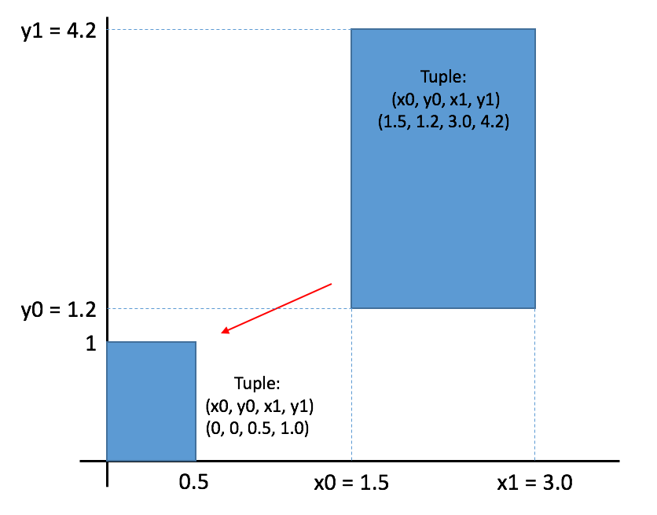

> ## Scientist's nightmare
>
> If you needed any motivation to learn and employ the principles of defensive programming,
> look no further than [this article](http://science.sciencemag.org/content/314/5807/1856).
> It documents the experience of a researcher who had to retract five published papers -
> three of which were in *Science* - because his code had inadvertently switched
> the rows and columns of a data table.
>
{: .callout}

Now that we've written `plot_precipitation_climatology.py`,
how can we be sure that it's producing reliable results?

The first step toward getting the right answers from our programs
is to assume that mistakes *will* happen
and to guard against them.
This is called defensive programming,
and the most common way to do it is to add assertions to our code
so that it checks itself as it runs.
An assertion is simply a statement that something must be true at a certain point in a program.
When Python sees one,
it evaluates the assertion's condition.
If it's true,
Python does nothing,
but if it's false,
Python halts the program immediately
and prints the error message if one is provided.
For example,
this piece of code halts as soon as the loop encounters a value that isn't positive:

~~~
numbers = [1.5, 2.3, 0.7, -0.001, 4.4]
total = 0.0
for n in numbers:
    assert n > 0.0, 'Data should only contain positive values'
    total += n
print('total is:', total)
~~~
{: .language-python}

~~~
---------------------------------------------------------------------------
AssertionError                            Traceback (most recent call last)
<ipython-input-19-33d87ea29ae4> in <module>()
      2 total = 0.0
      3 for n in numbers:
----> 4     assert n > 0.0, 'Data should only contain positive values'
      5     total += n
      6 print('total is:', total)

AssertionError: Data should only contain positive values
~~~
{: .error}

Programs like the Firefox browser are full of assertions:
10-20% of the code they contain
are there to check that the other 80-90% are working correctly.
Broadly speaking,
assertions fall into three categories:

*   A *precondition* is something that must be true at the start of a function in order for it to work correctly.

*   A *postcondition* is something that the function guarantees is true when it finishes.

*   An *invariant* is something that is always true at a particular point inside a piece of code.

For example,
suppose we are representing rectangles using a tuple of four coordinates `(x0, y0, x1, y1)`,
representing the lower left and upper right corners of the rectangle.
In order to do some calculations,
we need to normalize the rectangle so that the lower left corner is at the origin
and the longest side is 1.0 units long.

This function does that,
but checks that its input is correctly formatted and that its result makes sense:

~~~
def normalize_rectangle(rect):
    '''Normalizes a rectangle so that it is at the origin and 1.0 units long on its longest axis.
    Input should be of the format (x0, y0, x1, y1). 
    (x0, y0) and (x1, y1) define the lower left and upper right corners of the rectangle, respectively.'''
    assert len(rect) == 4, 'Rectangles must contain 4 coordinates'
    x0, y0, x1, y1 = rect
    assert x0 < x1, 'Invalid X coordinates'
    assert y0 < y1, 'Invalid Y coordinates'

    dx = x1 - x0
    dy = y1 - y0
    if dx > dy:
        scaled = float(dx) / dy
        upper_x, upper_y = 1.0, scaled
    else:
        scaled = float(dx) / dy
        upper_x, upper_y = scaled, 1.0

    assert 0 < upper_x <= 1.0, 'Calculated upper X coordinate invalid'
    assert 0 < upper_y <= 1.0, 'Calculated upper Y coordinate invalid'

    return (0, 0, upper_x, upper_y)
~~~
{: .language-python}

The preconditions on lines 3, 5, and 6 catch invalid inputs:

~~~
print(normalize_rectangle( (0.0, 1.0, 2.0) )) # missing the fourth coordinate
~~~
{: .language-python}

~~~
---------------------------------------------------------------------------
AssertionError                            Traceback (most recent call last)
<ipython-input-21-3a97b1dcab70> in <module>()
----> 1 print(normalize_rectangle( (0.0, 1.0, 2.0) )) # missing the fourth coordinate

<ipython-input-20-408dc39f3915> in normalize_rectangle(rect)
      1 def normalize_rectangle(rect):
      2     '''Normalizes a rectangle so that it is at the origin and 1.0 units long on its longest axis.'''
----> 3     assert len(rect) == 4, 'Rectangles must contain 4 coordinates'
      4     x0, y0, x1, y1 = rect
      5     assert x0 < x1, 'Invalid X coordinates'

AssertionError: Rectangles must contain 4 coordinates
~~~
{: .error}

~~~
print(normalize_rectangle( (4.0, 2.0, 1.0, 5.0) )) # X axis inverted
~~~
{: .language-python}

~~~
---------------------------------------------------------------------------
AssertionError                            Traceback (most recent call last)
<ipython-input-22-f05ae7878a45> in <module>()
----> 1 print(normalize_rectangle( (4.0, 2.0, 1.0, 5.0) )) # X axis inverted

<ipython-input-20-408dc39f3915> in normalize_rectangle(rect)
      3     assert len(rect) == 4, 'Rectangles must contain 4 coordinates'
      4     x0, y0, x1, y1 = rect
----> 5     assert x0 < x1, 'Invalid X coordinates'
      6     assert y0 < y1, 'Invalid Y coordinates'
      7

AssertionError: Invalid X coordinates
~~~
{: .error}

The post-conditions on lines 17 and 18 help us catch bugs by telling us when our calculations cannot have been correct.
For example,
if we normalize a rectangle that is taller than it is wide everything seems OK:

~~~
print(normalize_rectangle( (0.0, 0.0, 1.0, 5.0) ))
~~~
{: .language-python}

~~~
(0, 0, 0.2, 1.0)
~~~
{: .output}

but if we normalize one that's wider than it is tall,
the assertion is triggered:

~~~
print(normalize_rectangle( (0.0, 0.0, 5.0, 1.0) ))
~~~
{: .language-python}

~~~
---------------------------------------------------------------------------
AssertionError                            Traceback (most recent call last)
<ipython-input-24-5f0ef7954aeb> in <module>()
----> 1 print(normalize_rectangle( (0.0, 0.0, 5.0, 1.0) ))

<ipython-input-20-408dc39f3915> in normalize_rectangle(rect)
     16
     17     assert 0 < upper_x <= 1.0, 'Calculated upper X coordinate invalid'
---> 18     assert 0 < upper_y <= 1.0, 'Calculated upper Y coordinate invalid'
     19
     20     return (0, 0, upper_x, upper_y)

AssertionError: Calculated upper Y coordinate invalid
~~~
{: .error}

Re-reading our function,
we realize that line 11 should divide `dy` by `dx` rather than `dx` by `dy`.
(You can display line numbers by typing Ctrl-M, then L.)
If we had left out the assertion at the end of the function,
we would have created and returned something that had the right shape as a valid answer,
but wasn't.
Detecting and debugging that would almost certainly have taken more time in the long run
than writing the assertion.

But assertions aren't just about catching errors:
they also help people understand programs.
Each assertion gives the person reading the program
a chance to check (consciously or otherwise)
that their understanding matches what the code is doing.

> ## Testing and continuous integration
>
> An assertion checks that something is true at a particular point in the program.
> For programs that are more complex (or research critical) than `plot_precipitation_climatology.py`, 
> it's a good idea to take the next step and check the overall behavior of entire pieces (or units) of code.
> Related concepts like unit testing and continuous integration are beyond the scope of this lesson,
> but Software Carpentry have a [lesson on testing](http://katyhuff.github.io/python-testing/)
> that is well worth a read. 
>
{: .callout}

> ## Add your own assertions
>
> Add assertions to your copy of `plot_precipitation_climatology.py`.
> Once you're done, commit the changes to git and push to GitHub.
>
> > ## Solution
> >
> > There are many examples of assertions that could be added,
> > but the most critical is to check the units of the input data
> > before converting from kg m-2 s-1 to mm day-1.
> >
> > When an operation is performed on an xarray DataArray
> > most of the associated attributes (such as units) are removed,
> > so in this solution the original attributes are re-applied to the 
> > climatology DataArray after it is created.
> >
> > ~~~
> > ...
> >
> > def convert_pr_units(darray):
> >     """Convert kg m-2 s-1 to mm day-1.
> >    
> >     Args:
> >       darray (xarray.DataArray): Precipitation data
> >    
> >     """
> >    
> >     assert darray.units == 'kg m-2 s-1', "Program assumes input units are kg m-2 s-1"
> >    
> >     darray.data = darray.data * 86400
> >     darray.attrs['units'] = 'mm/day'
> >    
> >     return darray
> >
> > ...
> >
> > def main(inargs):
> >     """Run the program."""
> >
> >    dset = xr.open_dataset(inargs.pr_file)
> >    
> >    clim = dset['pr'].groupby('time.season').mean('time')
> >    clim.attrs = dset['pr'].attrs
> >    clim = convert_pr_units(clim)
> >
> > ...
> > 
> > ~~~
> > {: .language-python}
> {: .solution}
{: .challenge}

> ## plot_precipitation_climatology.py
>
> At the conclusion of this lesson your `plot_precipitation_climatology.py` script
> should look something like the following:
>
> ~~~
> import pdb
> import argparse
>
> import numpy as np
> import matplotlib.pyplot as plt
> import xarray as xr
> import cartopy.crs as ccrs
> import cmocean
>
>
> def convert_pr_units(darray):
>     """Convert kg m-2 s-1 to mm day-1.
>     
>     Args:
>       darray (xarray.DataArray): Precipitation data
>    
>    """
>    
>    assert darray.units == 'kg m-2 s-1', "Program assumes input units are kg m-2 s-1"
>
>    darray.data = darray.data * 86400
>    darray.attrs['units'] = 'mm/day'
>    
>    return darray
>
>
> def apply_mask(darray, sftlf_file, realm):
>     """Mask ocean or land using a sftlf (land surface fraction) file.
>    
>     Args:
>       darray (xarray.DataArray): Data to mask
>       sftlf_file (str): Land surface fraction file
>       realm (str): Realm to mask
>    
>     """
>   
>     dset = xr.open_dataset(sftlf_file)
>   
>     if realm == 'land':
>         masked_darray = darray.where(dset['sftlf'].data < 50)
>     else:
>         masked_darray = darray.where(dset['sftlf'].data > 50)   
>    
>     return masked_darray
>
>
> def create_plot(clim, model_name, season, gridlines=False, levels=None):
>     """Plot the precipitation climatology.
>     
>     Args:
>       clim (xarray.DataArray): Precipitation climatology data
>       model_name (str): Name of the climate model
>       season (str): Season
>      
>     Kwargs:
>       gridlines (bool): Select whether to plot gridlines
>       levels (list): Tick marks on the colorbar    
>     
>     """
>
>     if not levels:
>         levels = np.arange(0, 13.5, 1.5)
>        
>     fig = plt.figure(figsize=[12,5])
>     ax = fig.add_subplot(111, projection=ccrs.PlateCarree(central_longitude=180))
>     clim.sel(season=season).plot.contourf(ax=ax,
>                                           levels=levels,
>                                           extend='max',
>                                           transform=ccrs.PlateCarree(),
>                                           cbar_kwargs={'label': clim.units},
>                                           cmap=cmocean.cm.haline_r)
>     ax.coastlines()
>     if gridlines:
>         plt.gca().gridlines()
>     
>     title = '%s precipitation climatology (%s)' %(model_name, season)
>     plt.title(title)
>
>
> def main(inargs):
>     """Run the program."""
> 
>     dset = xr.open_dataset(inargs.pr_file)
>     
>     clim = dset['pr'].groupby('time.season').mean('time')
>     clim.attrs = dset['pr'].attrs
>     clim = convert_pr_units(clim)
> 
>     if inargs.mask:
>         sftlf_file, realm = inargs.mask
>         clim = apply_mask(clim, sftlf_file, realm)
>
>     create_plot(clim, dset.attrs['model_id'], inargs.season,
>                 gridlines=inargs.gridlines, levels=inargs.cbar_levels)
>     plt.savefig(inargs.output_file, dpi=200)
>
>
> if __name__ == '__main__':
>     description='Plot the precipitation climatology for a given season.'
>     parser = argparse.ArgumentParser(description=description)
>    
>     parser.add_argument("pr_file", type=str, help="Precipitation data file")
>     parser.add_argument("season", type=str, help="Season to plot")
>     parser.add_argument("output_file", type=str, help="Output file name")
> 
>     parser.add_argument("--gridlines", action="store_true", default=False,
>                         help="Include gridlines on the plot")
>     parser.add_argument("--cbar_levels", type=float, nargs='*', default=None,
>                         help='list of levels / tick marks to appear on the colorbar')
>     parser.add_argument("--mask", type=str, nargs=2,
>                         metavar=('SFTLF_FILE', 'REALM'), default=None,
>                         help="""Provide sftlf file and realm to mask ('land' or 'ocean')""")
>
>     args = parser.parse_args()
>   
>     main(args)
>
> ~~~
> {: .language-python}
{: .solution}
