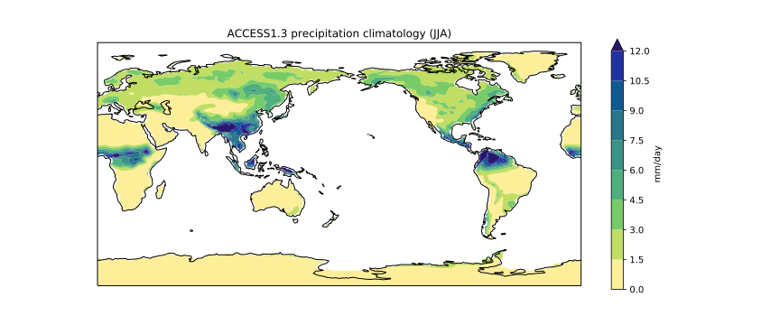

> ## Scientist's nightmare
>
> If you needed any motivation to learn and employ the principles of defensive programming,
> look no further than [this article](http://science.sciencemag.org/content/314/5807/1856).
> It documents the experience of a researcher who had to retract five published papers -
> three of which were in *Science* - because his code had inadvertently switched
> the rows and columns of a data table.
>
{: .callout}

Now that we've written `plot_precipitation_climatology.py`,
how can we be sure that it's producing reliable results?

The first step toward getting the right answers from our programs
is to assume that mistakes *will* happen
and to guard against them.
This is called defensive programming,
and the most common way to do it is to add assertions to our code
so that it checks itself as it runs.
An assertion is simply a statement that something must be true at a certain point in a program.
When Python sees one,
it evaluates the assertion's condition.
If it's true,
Python does nothing,
but if it's false,
Python halts the program immediately
and prints the error message if one is provided.

To demonstrate an assertion in action,
consider this piece of code that halts as soon as the loop encounters a rainfall observation value that isn't positive:

~~~
rainfall_obs = [1.5, 2.3, 0.7, -0.2, 4.4]
total = 0.0
for ob in rainfall_obs:
    assert ob >= 0.0, 'Rainfall observations should only contain positive values'
    total += ob
print('total rainfall is:', total)
~~~
{: .language-python}

~~~
---------------------------------------------------------------------------
AssertionError                            Traceback (most recent call last)
<ipython-input-19-33d87ea29ae4> in <module>()
      2 total = 0.0
      3 for ob in rainfall_obs:
----> 4     assert ob > 0.0, 'Rainfall observations should only contain positive values'
      5     total += ob
      6 print('total rainfall is:', total)

AssertionError: Rainfall observations should only contain positive values
~~~
{: .error}

Programs like the Firefox browser are full of assertions:
10-20% of the code they contain
are there to check that the other 80-90% are working correctly.

To see how assertions might be useful
in the context of the `plot_precipitation_climatology.py` script,
let's try the following at the command line:

~~~
$ python plot_precipitation_climatology.py data/pr_Amon_ACCESS1-3_historical_r1i1p1_200101-200512.nc JJA pr_Amon_ACCESS1-3_historical_r1i1p1_200101-200512-JJA-clim_land-mask.png --mask data/sftlf_fx_ACCESS1-3_historical_r0i0p0.nc Land
~~~
{: .language-bash}

If we view the resulting image,
we can see that the ocean has been masked,
even though we specified the land at the command line.

When confronted with perplexing code behaviour like this,
it can be useful to insert a tracer into your scripts using the Python debugger:

~~~
import pdb

...
def apply_mask(darray, sftlf_file, realm):
    """Mask ocean or land using a sftlf (land surface fraction) file.
    
    Args:
      darray (xarray.DataArray): Data to mask
      sftlf_file (str): Land surface fraction file
      realm (str): Realm to mask
    
    """
   
    dset = xr.open_dataset(sftlf_file)
    pdb.set_trace()    
    if realm == 'land':
        masked_darray = darray.where(dset['sftlf'].data < 50)
    else:
        masked_darray = darray.where(dset['sftlf'].data > 50)   
   
    return masked_darray

...
~~~
{: .language-python}

When we run the script,
it will stop at the tracer and allow us to interrogate the code:
~~~
$ python plot_precipitation_climatology.py data/pr_Amon_ACCESS1-3_historical_r1i1p1_200101-200512.nc JJA pr_Amon_ACCESS1-3_historical_r1i1p1_200101-200512-JJA-clim_land-mask.png --mask data/sftlf_fx_ACCESS1-3_historical_r0i0p0.nc Land
~~~
{: .language-bash}

~~~
> /Users/irv033/Desktop/data-carpentry/plot_precipitation_climatology.py(40)apply_mask()
-> if realm == 'land':
~~~
{: .output}

~~~
(Pdb) print(realm)
~~~
{: .language-bash}

~~~
Land
~~~
{: .output}

~~~
(Pdb) 'Land' == 'land'
~~~
{: .language-bash}

~~~
False
~~~
{: .output}

The problem appears to be that Python strings are case sensitive,
which means we should have entered `land` as opposed to `Land` at the command line.
We can fix this issue while in debug mode and then step through the code line by line
(using `n`) to make sure the correct where statement is executed.
~~~
(Pdb) realm = 'land'
(Pdb) n
~~~
{: .language-bash}

~~~
> /Users/irv033/Desktop/data-carpentry/plot_precipitation_climatology.py(41)apply_mask()
-> masked_darray = darray.where(dset['sftlf'].data < 50)
~~~
{: .output}

Once we're satisfied, we can enter `c` to run the remainder of the script
(it's `q` to quit at any time).

To avoid making this case sensitive mistake in future,
we should now remove the debugging tracer and replace it with an assertion
to catch invalid inputs,
~~~
...
def apply_mask(darray, sftlf_file, realm):
    """Mask ocean or land using a sftlf (land surface fraction) file.
    
    Args:
      darray (xarray.DataArray): Data to mask
      sftlf_file (str): Land surface fraction file
      realm (str): Realm to mask
    
    """
   
    dset = xr.open_dataset(sftlf_file)
    assert realm in ['land', 'ocean'], """Valid realms are 'land' or 'ocean'"""   
    if realm == 'land':
        masked_darray = darray.where(dset['sftlf'].data < 50)
    else:
        masked_darray = darray.where(dset['sftlf'].data > 50)   
   
    return masked_darray

...
~~~
{: .language-python}

test to make sure it's working,
~~~
$ python plot_precipitation_climatology.py data/pr_Amon_ACCESS1-3_historical_r1i1p1_200101-200512.nc JJA pr_Amon_ACCESS1-3_historical_r1i1p1_200101-200512-JJA-clim_land-mask.png --mask data/sftlf_fx_ACCESS1-3_historical_r0i0p0.nc Land
~~~
{: .language-bash}

~~~
Traceback (most recent call last):
  File "plot_precipitation_climatology.py", line 120, in <module>
    main(args)
  File "plot_precipitation_climatology.py", line 91, in main
    clim = apply_mask(clim, sftlf_file, realm)
  File "plot_precipitation_climatology.py", line 39, in apply_mask
    assert realm in ['land', 'ocean'], """Valid realms are 'land' or 'ocean'"""
AssertionError: Valid realms are 'land' or 'ocean'
~~~
{: .error}

and then commit the changes to git and push to GitHub.
~~~
$ git add plot_precipitation_climatology.py
$ git commit -m "Added realm check"
$ git push origin master
~~~
{: .language-bash}

> ## Testing and continuous integration
>
> An assertion checks that something is true at a particular point in the program.
> For programs that are more complex (or research critical) than `plot_precipitation_climatology.py`, 
> it's a good idea to take the next step and check the overall behavior of entire pieces (or units) of code.
> Related concepts like unit testing and continuous integration are beyond the scope of this lesson,
> but Software Carpentry have a [lesson on testing](http://katyhuff.github.io/python-testing/)
> that is well worth a read. 
>
{: .callout}

> ## Add your own assertions
>
> Add some more assertions to your copy of `plot_precipitation_climatology.py`.
> Once you're done, commit the changes to git and push to GitHub.
>
> > ## Solution
> >
> > There are many examples of assertions that could be added,
> > but the most critical is to check the units of the input data
> > before converting from kg m-2 s-1 to mm day-1.
> >
> > ~~~
> > ...
> >
> > def convert_pr_units(darray):
> >     """Convert kg m-2 s-1 to mm day-1.
> >    
> >     Args:
> >       darray (xarray.DataArray): Precipitation data
> >    
> >     """
> >    
> >     assert darray.units == 'kg m-2 s-1', "Program assumes input units are kg m-2 s-1"
> >    
> >     darray.data = darray.data * 86400
> >     darray.attrs['units'] = 'mm/day'
> >    
> >     return darray
> >
> > ...
> > 
> > ~~~
> > {: .language-python}
> {: .solution}
{: .challenge}

> ## plot_precipitation_climatology.py
>
> At the conclusion of this lesson your `plot_precipitation_climatology.py` script
> should look something like the following:
>
> ~~~
> import pdb
> import argparse
>
> import numpy as np
> import matplotlib.pyplot as plt
> import xarray as xr
> import cartopy.crs as ccrs
> import cmocean
>
>
> def convert_pr_units(darray):
>     """Convert kg m-2 s-1 to mm day-1.
>     
>     Args:
>       darray (xarray.DataArray): Precipitation data
>    
>    """
>    
>    assert darray.units == 'kg m-2 s-1', "Program assumes input units are kg m-2 s-1"
>
>    darray.data = darray.data * 86400
>    darray.attrs['units'] = 'mm/day'
>    
>    return darray
>
>
> def apply_mask(darray, sftlf_file, realm):
>     """Mask ocean or land using a sftlf (land surface fraction) file.
>    
>     Args:
>       darray (xarray.DataArray): Data to mask
>       sftlf_file (str): Land surface fraction file
>       realm (str): Realm to mask
>    
>     """
>   
>     dset = xr.open_dataset(sftlf_file)
>     assert realm in ['land', 'ocean'], """Valid realms are 'land' or 'ocean'"""
>     if realm == 'land':
>         masked_darray = darray.where(dset['sftlf'].data < 50)
>     else:
>         masked_darray = darray.where(dset['sftlf'].data > 50)   
>    
>     return masked_darray
>
>
> def create_plot(clim, model_name, season, gridlines=False, levels=None):
>     """Plot the precipitation climatology.
>     
>     Args:
>       clim (xarray.DataArray): Precipitation climatology data
>       model_name (str): Name of the climate model
>       season (str): Season
>      
>     Kwargs:
>       gridlines (bool): Select whether to plot gridlines
>       levels (list): Tick marks on the colorbar    
>     
>     """
>
>     if not levels:
>         levels = np.arange(0, 13.5, 1.5)
>        
>     fig = plt.figure(figsize=[12,5])
>     ax = fig.add_subplot(111, projection=ccrs.PlateCarree(central_longitude=180))
>     clim.sel(season=season).plot.contourf(ax=ax,
>                                           levels=levels,
>                                           extend='max',
>                                           transform=ccrs.PlateCarree(),
>                                           cbar_kwargs={'label': clim.units},
>                                           cmap=cmocean.cm.haline_r)
>     ax.coastlines()
>     if gridlines:
>         plt.gca().gridlines()
>     
>     title = '%s precipitation climatology (%s)' %(model_name, season)
>     plt.title(title)
>
>
> def main(inargs):
>     """Run the program."""
> 
>     dset = xr.open_dataset(inargs.pr_file)
>     
>     clim = dset['pr'].groupby('time.season').mean('time', keep_attrs=True)
>     clim = convert_pr_units(clim)
> 
>     if inargs.mask:
>         sftlf_file, realm = inargs.mask
>         clim = apply_mask(clim, sftlf_file, realm)
>
>     create_plot(clim, dset.attrs['model_id'], inargs.season,
>                 gridlines=inargs.gridlines, levels=inargs.cbar_levels)
>     plt.savefig(inargs.output_file, dpi=200)
>
>
> if __name__ == '__main__':
>     description='Plot the precipitation climatology for a given season.'
>     parser = argparse.ArgumentParser(description=description)
>    
>     parser.add_argument("pr_file", type=str, help="Precipitation data file")
>     parser.add_argument("season", type=str, help="Season to plot")
>     parser.add_argument("output_file", type=str, help="Output file name")
> 
>     parser.add_argument("--gridlines", action="store_true", default=False,
>                         help="Include gridlines on the plot")
>     parser.add_argument("--cbar_levels", type=float, nargs='*', default=None,
>                         help='list of levels / tick marks to appear on the colorbar')
>     parser.add_argument("--mask", type=str, nargs=2,
>                         metavar=('SFTLF_FILE', 'REALM'), default=None,
>                         help="""Provide sftlf file and realm to mask ('land' or 'ocean')""")
>
>     args = parser.parse_args()
>   
>     main(args)
>
> ~~~
> {: .language-python}
{: .solution}
