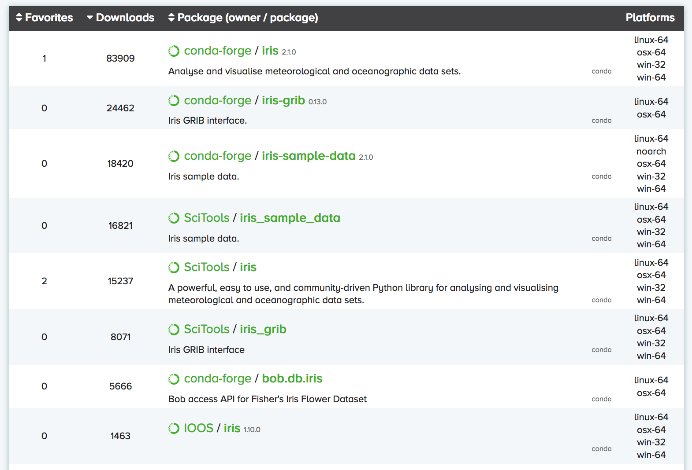

::::::::::::::::::::::::::::::::::::::: objectives

- Identify the main Python libraries used in atmosphere and ocean science and the relationships between them.
- Explain the advantages of Anaconda over other Python distributions.
- Extend the number of packages available via conda using conda-forge.
- Create a conda environment with the libraries needed for these lessons.
- Open a Jupyter Notebook ready for use in these lessons

::::::::::::::::::::::::::::::::::::::::::::::::::

:::::::::::::::::::::::::::::::::::::::: questions

- What are the main Python libraries used in atmosphere and ocean science?
- How do I install and manage all the Python libraries that I want to use?
- How do I interact with Python?

::::::::::::::::::::::::::::::::::::::::::::::::::

## The PyAOS stack

Before we jump in and start analysing our netCDF precipitation data files,
we need to consider what Python libraries are best suited to the task.

For reading, writing and analysing data stored in the netCDF file format,
atmosphere and ocean scientists will typically do most of their work with either the
[xarray](https://docs.xarray.dev) or [iris](https://scitools-iris.readthedocs.io/) libraries.
These libraries are built on top of more generic data science libraries like numpy and matplotlib,
to make the types of analysis we do faster and more efficient.
To learn more about the PyAOS "stack" shown in the diagram below
(i.e. the collection of libraries that are typically used for
data analysis and visualisation in the atmosphere and ocean sciences),
check out the [overview of the PyAOS stack](https://pyaos.github.io/stack/)
at the PyAOS community site.

{alt='PyAOS stack'}

## Python distributions for data science

Now that we've identified the Python libraries we might want to use,
how do we go about installing them?

Our first impulse might be to use the Python package installer (pip),
but it really only works for libraries written in pure Python.
This is a major limitation for the data science community,
because many scientific Python libraries have C and/or Fortran dependencies.
To spare people the pain of installing these dependencies,
a number of scientific Python "distributions" have been released over the years.
These come with the most popular data science libraries and their dependencies pre-installed,
and some also come with a package manager to assist with installing
additional libraries that weren't pre-installed.
Today the most popular distribution for data science is [Anaconda](https://docs.anaconda.com/anaconda/),
which comes with a package (and environment) manager called [conda](https://conda.io/docs/).

## Introducing conda

According to the [latest documentation]([https://docs.anaconda.com/anaconda/),
Anaconda comes with over 300 of the most widely used data science libraries (and their dependencies) pre-installed.
In addition, there are several thousand more libraries available via the Anaconda Public Repository, 
which can be installed by running the `conda install` command the Bash Shell or Anaconda Prompt (Windows only).
It is also possible to install packages using the Anaconda Navigator graphical user interface.

:::::::::::::::::::::::::::::::::::::::::  callout

## conda in the shell on windows

If you're on a Windows machine and the `conda` command isn't available at the Bash Shell,
you'll need to open the Anaconda Prompt program (via the Windows start menu)
and run the command `conda init bash` (this only needs to be done once).
After that, your Bash Shell will be configured to use `conda` going forward.

::::::::::::::::::::::::::::::::::::::::::::::::::

For instance, the popular `xarray` library could be installed using the following command,

```bash
$ conda install xarray
```

(Use `conda search -f {package_name}` to find out if a package you want is available.)

OR using Anaconda Navigator:

{alt='Anaconda Navigator xarray search'}

:::::::::::::::::::::::::::::::::::::::::  callout

## Miniconda

If you don't want to install the entire Anaconda distribution,
you can install [Miniconda](https://docs.anaconda.com/miniconda/) instead.
It essentially comes with conda and nothing else.

::::::::::::::::::::::::::::::::::::::::::::::::::

## Advanced conda

For a relatively small/niche field of research like atmosphere and ocean science,
one of the most important features that Anaconda provides is the
[Anaconda Cloud](https://anaconda.org) website,
where the community can contribute conda installation packages.
This is critical because many of our libraries have a small user base,
which means they'll never make it into the Anaconda Public Repository.

You can search Anaconda Cloud to find the command needed to install the package.
For instance, here is the search result for the `iris` package:

{alt='Iris search on Anaconda Cloud'}

As you can see, there are often multiple versions of the same package up on Anaconda Cloud.
To try and address this duplication problem,
[conda-forge](https://conda-forge.org/) has been launched,
which aims to be a central repository that contains just a single (working) version
of each package on Anaconda Cloud.
You can therefore expand the selection of packages available via `conda install`
beyond the chosen few thousand by adding the conda-forge channel:

```bash
$ conda config --add channels conda-forge
```

OR

{alt='Anaconda Navigator conda-forge'}

We recommend not adding any other third-party channels unless absolutely necessary,
because mixing packages from multiple channels can cause headaches like binary incompatibilities.

## Software installation for these lessons

For these particular lessons we will use `xarray`,
but all the same tasks could be performed with `iris`.
We'll also install
[`dask`](https://www.dask.org/) (`xarray` uses this for parallel processing),
[`netCDF4`](https://unidata.github.io/netcdf4-python/) (`xarray` requires this to read netCDF files),
[`cartopy`](https://scitools.org.uk/cartopy/) (to help with geographic plot projections),
[`cmocean`](https://matplotlib.org/cmocean/) (for nice color palettes) and
[`cmdline_provenance`](https://cmdline-provenance.readthedocs.io/en/latest/)
(to keep track of our data processing steps).
We don't need to worry about installing [jupyter](https://jupyter.org/)
(we will be using the jupyter notebook) because it already comes
pre-installed with Anaconda.

We could install these libraries from Anaconda Navigator (not shown)
or using the Bash Shell or Anaconda Prompt (Windows):

```bash
$ conda install xarray dask netCDF4 cartopy cmocean cmdline_provenance
```

If we then list all the libraries that we've got installed,
we can see that `jupyter`, `dask`, `xarray`, `netCDF4`, `cartopy`, `cmocean`, `cmdline_provenance`
and their dependencies are now there:

```bash
$ conda list
```

(This list can also be viewed in the environments tab of the Navigator.)

:::::::::::::::::::::::::::::::::::::::::  callout

## Creating separate environments

If you've got multiple data science projects on the go,
installing all your packages in the same conda environment can get a little messy.
(By default they are installed in the root/base environment.)
It's therefore common practice to
[create separate conda environments](https://conda.io/projects/conda/en/latest/user-guide/tasks/manage-environments.html)
for the various projects you're working on.

For instance, we could create an environment called `pyaos-lesson` for this lesson.
The process of creating a new environment can be managed in the environments tab
of the Anaconda Navigator or via the following Bash Shell / Anaconda Prompt commands:

```bash
$ conda create -n pyaos-lesson jupyter xarray dask netCDF4 cartopy cmocean cmdline_provenance
$ conda activate pyaos-lesson
```

(it's `conda deactivate` to exit)

Notice that in this case we had to include jupyter in the list of packages to install.
When you create a brand new conda environment,
it doesn't automatically come with the pre-installed packages
that are in the base environment.

You can have lots of different environments,

```bash
$ conda info --envs
```

```output
# conda environments:
#
base                  *  /anaconda3
pyaos-lesson             /anaconda3/envs/pyaos-lesson
test                     /anaconda3/envs/test
```

the details of which can be exported to a YAML configuration file:

```bash
$ conda env export -n pyaos-lesson -f pyaos-lesson.yml
$ cat pyaos-lesson.yml
```

```output
name: pyaos-lesson
channels:
  - conda-forge
  - defaults
dependencies:
  - cartopy=0.16.0=py36h81b52dc_1
  - certifi=2018.4.16=py36_0
  - cftime=1.0.1=py36h7eb728f_0
  - ...
```

Other people (or you on a different computer) can then re-create that exact environment
using the YAML file:

```bash
$ conda env create -f pyaos-lesson.yml
```

The ease with which others can recreate your environment (on any operating system)
is a huge breakthough for reproducible research.

To delete the environment:

```bash
$ conda env remove -n pyaos-lesson
```

::::::::::::::::::::::::::::::::::::::::::::::::::

## Interacting with Python

Now that we know which Python libraries we want to use and how to install them,
we need to decide how we want to interact with Python.

The most simple way to use Python is to type code directly into the interpreter.
This can be accessed from the bash shell:

```
$ python
Python 3.7.1 (default, Dec 14 2018, 13:28:58) 
[Clang 4.0.1 (tags/RELEASE_401/final)] :: Anaconda, Inc. on darwin
Type "help", "copyright", "credits" or "license" for more information.
>>> print("hello world")
hello world
>>> exit()
$
```

The `>>>` prompt indicates that you are now talking to the Python interpreter.

A more powerful alternative to the default Python interpreter is IPython (Interactive Python).
The [online documentation](https://ipython.readthedocs.io)
outlines all the special features that come with IPython,
but as an example, it lets you execute bash shell commands
without having to exit the IPython interpreter:

```
$ ipython
Python 3.7.1 (default, Dec 14 2018, 13:28:58) 
Type 'copyright', 'credits' or 'license' for more information
IPython 7.2.0 -- An enhanced Interactive Python. Type '?' for help.

In [1]: print("hello world")                                                    
hello world

In [2]: ls                                                                      
data/                              script_template.py
plot_precipitation_climatology.py

In [3]: exit                                                                    
$ 
```

(The IPython interpreter can also be accessed via the Anaconda Navigator
by running the QtConsole.)

While entering commands to the Python or IPython interpreter line-by-line
is great for quickly testing something,
it's clearly impractical for developing longer bodies of code
and/or interactively exploring data.
As such, Python users tend to do most of their code development and data exploration
using either an Integrated Development Environment (IDE) or Jupyter Notebook:

- Two of the most common IDEs are [Spyder](https://www.spyder-ide.org/)
  and [PyCharm](https://www.jetbrains.com/pycharm/)
  (the former comes with Anaconda)
  and will look very familiar to anyone
  who has used MATLAB or R-Studio.
- [Jupyter Notebooks](https://jupyter.org/) run in your web browser
  and allow users to create and share documents that contain live code,
  equations, visualizations and narrative text.

We are going to use the Jupyter Notebook to explore our precipitation data
(and the plotting functionality of xarray) in the next few lessons.
A notebook can be launched from our `data-carpentry` directory
using the Bash Shell:

```bash
$ cd ~/Desktop/data-carpentry
$ jupyter notebook &
```

(The `&` allows you to come back and use the bash shell without closing
your notebook first.)

Alternatively, you can launch Jupyter Notebook from the Anaconda Navigator
and navigate to the `data-carpentry` directory before creating a new
Python 3 notebook:

{alt='Launch Jupyter notebook'}

:::::::::::::::::::::::::::::::::::::::::  callout

## JupyterLab

If you like Jupyter Notebooks you might want to try [JupyterLab](https://jupyterlab.readthedocs.io),
which combines the Jupyter Notebook with many of the features common to an IDE.

::::::::::::::::::::::::::::::::::::::::::::::::::

:::::::::::::::::::::::::::::::::::::::  challenge

## Install the Python libraries required for this lesson

If you haven't already done so,
go ahead and install the `xarray`, `dask`, `netCDF4`, `cartopy`, `cmocean` and `cmdline_provenance`
packages using either the Anaconda Navigator or Bash Shell.

Remember that you'll need to add the conda-forge channel first.

(You may like to create a separate `pyaos-lesson` conda environment,
but this is not necessary to complete the lessons.
If you create a new environment rather than using the base environment,
you'll need to install jupyter too.)

:::::::::::::::  solution

The [software installation instructions](https://carpentries-lab.github.io/python-aos-lesson/#software-installation)
explain how to install the Python libraries using the Bash Shell or Anaconda Navigator.

:::::::::::::::::::::::::

::::::::::::::::::::::::::::::::::::::::::::::::::

:::::::::::::::::::::::::::::::::::::::  challenge

## Launch a Jupyer Notebook

In preparation for the next lesson,
open a new Jupyter Notebook **in your `data-carpentry` directory**
by entering `jupyter notebook &` at the Bash Shell
or by clicking the Jupyter Notebook launch button in the Anaconda Navigator.

If you use the Navigator,
the Jupyter interface will open in a new tab of your default web browser.
Use that interface to navigate to the `data-carpentry` directory
that you created specifically for these lessons
before clicking to create a new Python 3 notebook:

{alt='Launch Jupyter notebook'}

Once your notebook is open,
import `xarray`, `catropy`, `matplotlib` and `numpy`
using the following Python commands:

```python
import xarray as xr
import cartopy.crs as ccrs
import matplotlib.pyplot as plt
import numpy as np
```

(Hint: Hold down the shift and return keys to execute a code cell in a Jupyter Notebook.)

::::::::::::::::::::::::::::::::::::::::::::::::::

:::::::::::::::::::::::::::::::::::::::: keypoints

- xarray and iris are the core Python libraries used in the atmosphere and ocean sciences.
- Use conda to install and manage your Python environments.

::::::::::::::::::::::::::::::::::::::::::::::::::
