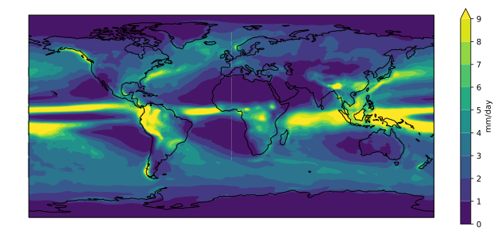
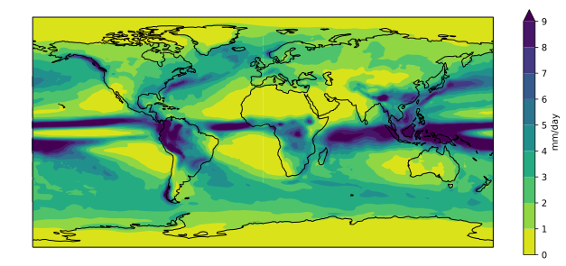

As a first step towards making a visual comparison of the
CSIRO-Mk3-6-0 and ACCESS1-3 historical precipitation climatology,
we are going to create a quick plot of the ACCESS1-3 data.
~~~
access_pr_file = 'data/pr_Amon_ACCESS1-3_historical_r1i1p1_200101-200512.nc'
~~~
{: .language-python}

We will need a number of the libraries introduced in the previous lesson.
~~~
import xarray as xr
import cartopy.crs as ccrs
import matplotlib.pyplot as plt
import numpy as np
~~~
{: .language-python}

Since geographic data files can often be very large,
when we first open our data file in xarray it simply loads the metadata
associated with the file (this is known as "lazy loading").
We can then view summary information about the contents of the file
before deciding whether we'd like to load some or all of the data into memory. 

~~~
dset = xr.open_dataset(access_pr_file)
print(dset)
~~~
{: .language-python}

~~~
<xarray.Dataset>
Dimensions:    (bnds: 2, lat: 145, lon: 192, time: 60)
Coordinates:
  * time       (time) datetime64[ns] 2001-01-16T12:00:00 2001-02-15 ...
  * lat        (lat) float64 -90.0 -88.75 -87.5 -86.25 -85.0 -83.75 -82.5 ...
  * lon        (lon) float64 0.0 1.875 3.75 5.625 7.5 9.375 11.25 13.12 15.0 ...
Dimensions without coordinates: bnds
Data variables:
    pr         (time, lat, lon) float32 ...
    time_bnds  (time, bnds) float64 ...
    lat_bnds   (lat, bnds) float64 ...
    lon_bnds   (lon, bnds) float64 ...
Attributes:
    CDI:                    Climate Data Interface version 1.7.1 (http://mpim...
    CDO:                    Climate Data Operators version 1.7.1 (http://mpim...
    NCO:                    4.7.0
    associated_files:       baseURL: http://cmip-pcmdi.llnl.gov/CMIP5/dataLoc...
    branch_time:            90945.0
    cmor_version:           2.8.0
    comment:                at surface; includes both liquid and solid phases...
    contact:                The ACCESS wiki: http://wiki.csiro.au/confluence/...
    creation_date:          2012-02-08T06:45:54Z
    experiment:             historical
    experiment_id:          historical
    forcing:                GHG, Oz, SA, Sl, Vl, BC, OC, (GHG = CO2, N2O, CH4...
    frequency:              mon
    history:                Tue Sep 18 11:36:11 2018: /anaconda3/envs/ocean/b...
    initialization_method:  1
    institute_id:           CSIRO-BOM
    institution:            CSIRO (Commonwealth Scientific and Industrial Res...
    model_id:               ACCESS1.3
    modeling_realm:         atmos
    parent_experiment:      pre-industrial control
    parent_experiment_id:   piControl
    parent_experiment_rip:  r1i1p1
    physics_version:        1
    product:                output
    project_id:             CMIP5
    realization:            1
    references:             See http://wiki.csiro.au/confluence/display/ACCES...
    source:                 ACCESS1-3 2011. Atmosphere: AGCM v1.0 (N96 grid-p...
    table_id:               Table Amon (27 April 2011) 9c851218e3842df9a62ef3...
    title:                  ACCESS1-3 model output prepared for CMIP5 historical
    tracking_id:            26bfc8da-78ff-4b10-9e13-24492c09bb59
    version_number:         v20120413
    Conventions:            CF-1.5
~~~
{: .output}

We can see that our `dset` object is an `xarray.Dataset`,
which when printed shows all the metadata associated with our netCDF data file.

In this case,
we are interested in the precipitation variable contained within that xarray Dataset:

~~~
print(dset['pr'])
~~~
{: .language-python}

~~~
<xarray.DataArray 'pr' (time: 60, lat: 145, lon: 192)>
[1670400 values with dtype=float32]
Coordinates:
  * time     (time) datetime64[ns] 2001-01-16T12:00:00 2001-02-15 ...
  * lat      (lat) float64 -90.0 -88.75 -87.5 -86.25 -85.0 -83.75 -82.5 ...
  * lon      (lon) float64 0.0 1.875 3.75 5.625 7.5 9.375 11.25 13.12 15.0 ...
Attributes:
    standard_name:  precipitation_flux
    long_name:      Precipitation
    units:          kg m-2 s-1
    cell_methods:   time: mean
~~~
{: .output}

We can actually use either the `dset['pr']` or `dset.pr` syntax to access the precipitation
`xarray.DataArray`.

To calculate the precipitation climatology,
we can make use of the fact that xarray DataArrays have built in functionality
for averaging over their dimensions. 

~~~
clim = dset['pr'].mean('time', keep_attrs=True)
print(clim)
~~~
{: .language-python}

~~~
<xarray.DataArray 'pr' (lat: 145, lon: 192)>
array([[2.542048e-06, 2.542048e-06, 2.542048e-06, ..., 2.541606e-06,
        2.541606e-06, 2.541606e-06],
       [2.511442e-06, 2.492513e-06, 2.472960e-06, ..., 2.570118e-06,
        2.550404e-06, 2.531296e-06],
       [2.396512e-06, 2.365124e-06, 2.330266e-06, ..., 2.472362e-06,
        2.455286e-06, 2.427222e-06],
       ...,
       [8.877672e-06, 8.903967e-06, 8.938327e-06, ..., 8.819357e-06,
        8.859161e-06, 8.873179e-06],
       [8.748589e-06, 8.739819e-06, 8.723918e-06, ..., 8.797057e-06,
        8.776324e-06, 8.789103e-06],
       [7.988647e-06, 7.988647e-06, 7.988647e-06, ..., 7.988647e-06,
        7.988647e-06, 7.988647e-06]], dtype=float32)
Coordinates:
  * lon      (lon) float64 0.0 1.875 3.75 5.625 7.5 9.375 11.25 13.12 15.0 ...
  * lat      (lat) float64 -90.0 -88.75 -87.5 -86.25 -85.0 -83.75 -82.5 ...
Attributes:
    standard_name:  precipitation_flux
    long_name:      Precipitation
    units:          kg m-2 s-1
    cell_methods:   time: mean
~~~
{: output}

> ## Dask
>
> Rather than read the entire three dimensional (time, lat, lon)
> data array into memory and then calculate the climatology,
> xarray lazy loading has allowed us to only load the
> two dimensional (lat, lon) climatology.
> If the original 3D data array was much larger than the one we are analysing here
> (i.e. so large that we'd get a memory error if we attempted to calculate the climatology)
> xarray can make use of a library called [Dask](http://xarray.pydata.org/en/stable/dask.html)
> to break the task down into chunks and distribute it to multiple cores if needed.
>
{: .callout}

Now that we've calculated the climatology, 
we want to convert the units from kg m-2 s-1
to something that we are a little more familiar with like mm day-1.

To do this, consider that
1 kg of rain water spread over 1 m2 of surface is 1 mm in thickness
and that there are 86400 seconds in one day.
Therefore, 1 kg m-2 s-1 = 86400 mm day-1.

The data associated with our xarray DataArray is simply a numpy array,

~~~
type(clim.data)
~~~
{: .language-python}

~~~
numpy.ndarray
~~~
{: .output}

so we can go ahead and multiply that array by 86400 and update the units attribute accordingly:

~~~
clim.data = clim.data * 86400
clim.attrs['units'] = 'mm/day' 

print(clim)
~~~
{: .language-python}

~~~
<xarray.DataArray 'pr' (lat: 145, lon: 192)>
array([[0.219633, 0.219633, 0.219633, ..., 0.219595, 0.219595, 0.219595],
       [0.216989, 0.215353, 0.213664, ..., 0.222058, 0.220355, 0.218704],
       [0.207059, 0.204347, 0.201335, ..., 0.213612, 0.212137, 0.209712],
       ...,
       [0.767031, 0.769303, 0.772271, ..., 0.761992, 0.765432, 0.766643],
       [0.755878, 0.75512 , 0.753746, ..., 0.760066, 0.758274, 0.759379],
       [0.690219, 0.690219, 0.690219, ..., 0.690219, 0.690219, 0.690219]])
Coordinates:
  * lon      (lon) float64 0.0 1.875 3.75 5.625 7.5 9.375 11.25 13.12 15.0 ...
  * lat      (lat) float64 -90.0 -88.75 -87.5 -86.25 -85.0 -83.75 -82.5 ...
Attributes:
    standard_name:  precipitation_flux
    long_name:      Precipitation
    units:          mm/day
    cell_methods:   time: mean
~~~
{: .output}

We could now go ahead and plot our climatology using matplotlib,
but it would take many lines of code to extract all the latitude and longitude information
and to setup all the plot characteristics.
Recognising this burden,
the xarray developers have built on top of `matplotlib.pyplot` to make the visualisation
of xarray DataArrays much easier.
~~~
fig = plt.figure(figsize=[12,5])

ax = fig.add_subplot(111, projection=ccrs.PlateCarree(central_longitude=180))

clim.plot.contourf(ax=ax,
                   levels=np.arange(0, 13.5, 1.5),
                   extend='max',
                   transform=ccrs.PlateCarree(),
                   cbar_kwargs={'label': clim.units})
ax.coastlines()

plt.show()
~~~
{: .language-python}

The default colorbar used by matplotlib is `viridis`.
It used to be `jet`,
but that was changed a couple of years ago in response to the 
[#endtherainbow](https://www.climate-lab-book.ac.uk/2014/end-of-the-rainbow/) campaign.

Putting all the code together
(and reversing viridis so that wet is purple and dry is yellow)...

~~~
import xarray as xr
import matplotlib.pyplot as plt
import cartopy.crs as ccrs
import numpy as np

access_pr_file = 'data/pr_Amon_ACCESS1-3_historical_r1i1p1_200101-200512.nc'

dset = xr.open_dataset(access_pr_file)

clim = dset['pr'].mean('time', keep_attrs=True)

clim.data = clim.data * 86400
clim.attrs['units'] = 'mm/day'

fig = plt.figure(figsize=[12,5])
ax = fig.add_subplot(111, projection=ccrs.PlateCarree(central_longitude=180))
clim.plot.contourf(ax=ax,
                   levels=np.arange(0, 13.5, 1.5),
                   extend='max',
                   transform=ccrs.PlateCarree(),
                   cbar_kwargs={'label': clim.units},
                   cmap='viridis_r')
ax.coastlines()
plt.show()
~~~
{: .language-python}

> ## Color palette
>
> Copy and paste the final slab of code above into your own Jupyter notebook.
>
> The viridis color palette doesn't seem quite right for rainfall.
> Change it to the "haline" [cmocean](http://matplotlib.org/cmocean/) palette
> used for ocean salinity data.
>
> > ## Solution
> > ~~~
> > import cmocean
> >
> > ...
> > clim.plot.contourf(ax=ax,
                       ...
                       cmap=cmocean.cm.haline_r)
> > ~~~
> > {: .language-python}
> {: .solution}
{: .challenge} 

> ## Season selection
>
> Rather than plot the annual climatology,
> edit the code so that it plots the June-August (JJA) season.
>
> (Hint: the [groupby]() functionality can be used to
> group all the data into seasons prior to averaging over the time axis) 
>
> > ## Solution
> > ~~~
> > clim = dset['pr'].groupby('time.season').mean('time', keep_attrs=True) 
> > 
> > clim.sel(season='JJA').plot.contourf(ax=ax,
> > ~~~
> > {: .language-python}
> {: .solution}
{: .challenge}

> ## Add a title
>
> Add a title to the plot which gives the name of the model
> (taken from the `dset` attributes)
> followed by the words "precipitation climatology (JJA)"
>
> > ## Solution
> > ~~~
> > title = '%s precipitation climatology (JJA)' %(dset.attrs['model_id'])
> > plt.title(title)
> > ~~~
> > {: .language-python}
> {: .solution}
{: .challenge}

