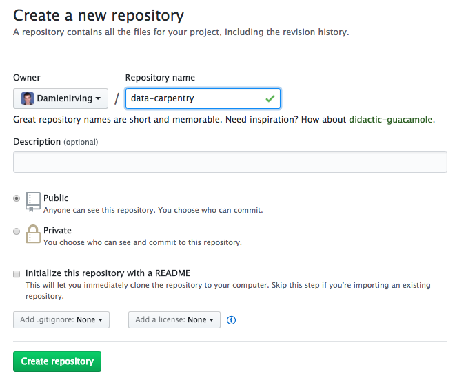
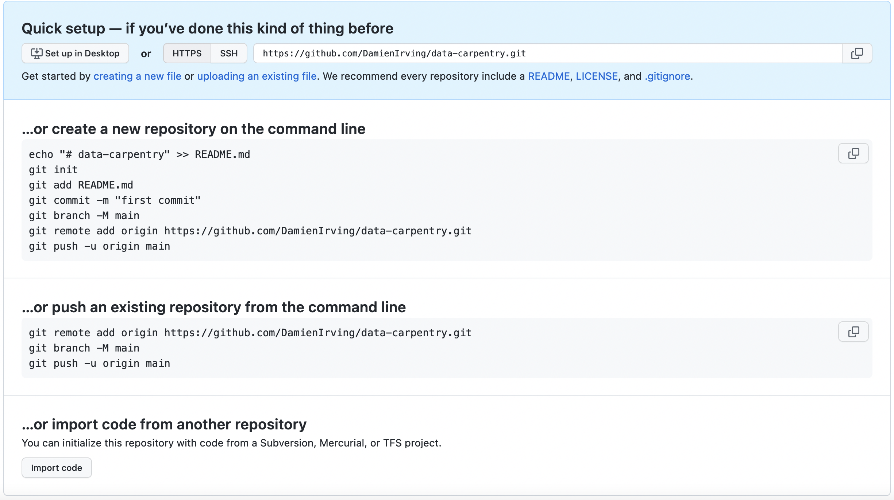
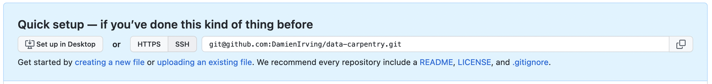
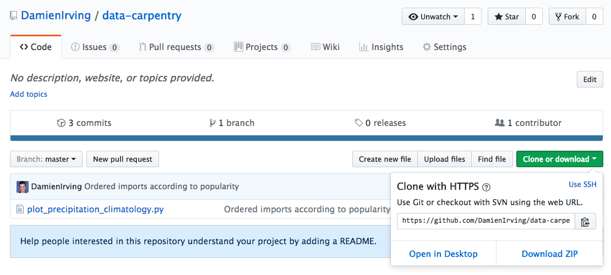

> ## Follow along
>
> For this lesson participants follow along command by command,
> rather than observing and then completing challenges afterwards.
>
{: .challenge}

## Creating a remote repository

Version control really comes into its own when we begin to collaborate with
other people (including ourselves for those who work on multiple computers).
We already have most of the machinery we need to do this; the
only thing missing is to copy changes from one repository to another.

Systems like Git allow us to move work between any two repositories. In
practice, though, it's easiest to use one copy as a central hub, and to keep it
on the web rather than on someone's laptop. Most programmers use hosting
services like [GitHub](https://github.com), [BitBucket](https://bitbucket.org) or
[GitLab](https://gitlab.com/) to hold those master copies.

Let's start by sharing the changes we've made to our current project with the
world. Log in to GitHub, then click on the icon in the top right corner to
create a new repository called `data-carpentry`:

Name your repository "data-carpentry" and then click "Create Repository":

As soon as the repository is created, GitHub displays a page with a URL and some
information on how to configure your local repository:

This effectively does the following on GitHub's servers:

~~~
$ mkdir data-carpentry
$ cd data-carpentry
$ git init
~~~
{: .language-bash}

Our local repository still contains our earlier work on `plot_precipitation_climatology.py`,
but the remote repository on GitHub doesn't contain any files yet.

The next step is to connect the two repositories. We do this by making the
GitHub repository a "remote" for the local repository.
The home page of the repository on GitHub includes the string we need to
identify it:

Click on the 'HTTPS' link to change the protocol from SSH to HTTPS if
HTTPS isn't already selected.

> ## HTTPS vs. SSH
>
> We use HTTPS here because it does not require additional configuration.  After
> the workshop you may want to set up SSH access, which is a bit more secure, by
> following one of the great tutorials from
> [GitHub](https://help.github.com/articles/generating-ssh-keys),
> [Atlassian/BitBucket](https://confluence.atlassian.com/display/BITBUCKET/Set+up+SSH+for+Git)
> and [GitLab](https://about.gitlab.com/2014/03/04/add-ssh-key-screencast/)
> (this one has a screencast).
{: .callout}

Copy that URL from the browser, go into the local `data-carpentry` repository,
and run this command:

~~~
$ git remote add origin https://github.com/DamienIrving/data-carpentry.git
~~~
{: .bash}

Make sure to use the URL for your repository rather than Damien's: the only
difference should be your username instead of `DamienIrving`.

We can check that the command has worked by running `git remote -v`:

~~~
$ git remote -v
~~~
{: .language-bash}

~~~
origin   https://github.com/DamienIrving/data-carpentry.git (push)
origin   https://github.com/DamienIrving/data-carpentry.git (fetch)
~~~
{: .output}

The name `origin` is a local nickname for your remote repository. We could use
something else if we wanted to, but `origin` is by far the most common choice.

Once the nickname `origin` is set up, this command will push the changes from
our local repository to the repository on GitHub:

~~~
$ git push origin master
~~~
{: .language-bash}

~~~
Counting objects: 9, done.
Delta compression using up to 4 threads.
Compressing objects: 100% (6/6), done.
Writing objects: 100% (9/9), 821 bytes, done.
Total 9 (delta 2), reused 0 (delta 0)
To https://github.com/DamienIrving/data-carpentry
 * [new branch]      master -> master
Branch master set up to track remote branch master from origin.
~~~
{: .output}

We can pull changes from the remote repository to the local one as well:

~~~
$ git pull origin master
~~~
{: .language-bash}

~~~
From https://github.com/DamienIrving/data-carpentry
 * branch            master     -> FETCH_HEAD
Already up-to-date.
~~~
{: .output}

Pulling has no effect in this case because the two repositories are already
synchronised. If someone else had pushed some changes to the repository on
GitHub, though, this command would download them to our local repository.

## Sharing code with yourself or others

If we logged onto a different computer
(e.g. a supercomputing facility or our desktop computer at home)
we could access a copy of our code by "cloning" it.

~~~
$ git clone https://github.com/DamienIrving/data-carpentry.git
~~~ 
{: .language-bash}

Since our repository is public,
anyone (e.g. research collaborators) could clone the repository
by getting the URL from the corresponding page on GitHub: 

> ## Working with others
>
> Someone who clones your repository can't push changes directly to it
> (unless you add them as a collaborator).
> They could, however, "fork" your repository and submit suggested changes via a "pull request".
> Collaborators and pull requests are beyond the scope of this lesson,
> but you may come across them as you get more experienced with 
> using git and GitHub.
{: .callout}
