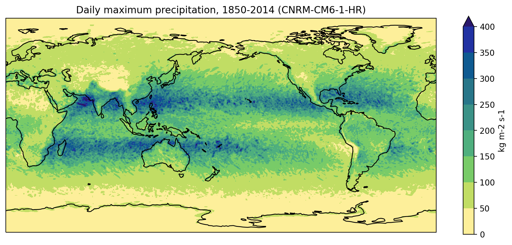

::::::::::::::::::::::::::::::::::::::: objectives

- Inspect netCDF chunking.
- Import the dask library and start a client with parallel workers.
- Calculate and plot the maximum daily precipitation for a high resolution model.

::::::::::::::::::::::::::::::::::::::::::::::::::

:::::::::::::::::::::::::::::::::::::::: questions

- How do I work with multiple CMIP files that won't fit in memory?

::::::::::::::::::::::::::::::::::::::::::::::::::

So far we've been working with small,
individual data files that can be comfortably read into memory on a modern laptop.
What if we wanted to process a larger dataset
that consists of many files and/or much larger file sizes?
For instance,
let's say the next step in our global precipitation analysis
is to plot the daily maximum precipitation over the 1850-2014 period
for the high resolution CNRM-CM6-1-HR model.

:::::::::::::::::::::::::::::::::::::::  challenge

## Data download

Instructors teaching this lesson can download the CNRM-CM6-1-HR
daily precipitation data from the Earth System Grid Federation (ESGF).
See the [instructor notes](https://carpentries-lab.github.io/python-aos-lesson/guide/index.html) for details.
Since it is a very large download (45 GB),
learners are not expected to download the data.
(None of the exercises at the end of the lesson require downloading the data.)

::::::::::::::::::::::::::::::::::::::::::::::::::

At the Unix shell,
we can inspect the dataset and see that the daily maximum precipitation data
for the 1850-2014 period has been broken up into 25-year chunks and
spread across seven netCDF files,
most of which are 6.7 GB in size.

```bash
$ ls -lh data/pr_day*.nc
```

```output
-rw-r-----  1 irving  staff   6.7G 26 Jan 12:09 pr_day_CNRM-CM6-1-HR_historical_r1i1p1f2_gr_18500101-18741231.nc
-rw-r-----  1 irving  staff   6.7G 26 Jan 13:14 pr_day_CNRM-CM6-1-HR_historical_r1i1p1f2_gr_18750101-18991231.nc
-rw-r-----  1 irving  staff   6.7G 26 Jan 14:17 pr_day_CNRM-CM6-1-HR_historical_r1i1p1f2_gr_19000101-19241231.nc
-rw-r-----  1 irving  staff   6.7G 26 Jan 15:20 pr_day_CNRM-CM6-1-HR_historical_r1i1p1f2_gr_19250101-19491231.nc
-rw-r-----  1 irving  staff   6.7G 26 Jan 16:24 pr_day_CNRM-CM6-1-HR_historical_r1i1p1f2_gr_19500101-19741231.nc
-rw-r-----  1 irving  staff   6.7G 26 Jan 17:27 pr_day_CNRM-CM6-1-HR_historical_r1i1p1f2_gr_19750101-19991231.nc
-rw-r-----  1 irving  staff   4.0G 26 Jan 18:05 pr_day_CNRM-CM6-1-HR_historical_r1i1p1f2_gr_20000101-20141231.nc
```

In order to work with these files,
we can use `xarray` to open a "multifile" dataset as though it were a single file.
Our first step is to open a new Jupyter notebook and
import a library with a rather unfortunate name.

```python
import glob
```

The `glob` library contains a single function, also called `glob`,
that finds files whose names match a pattern.
We provide those patterns as strings:
the character `*` matches zero or more characters,
while `?` matches any one character,
just like at the Unix shell.

```python
pr_files = glob.glob('data/pr_day*.nc')
pr_files.sort()
print(pr_files)
```

```output
['/Users/irving/Desktop/data-carpentry/data/pr_day_CNRM-CM6-1-HR_historical_r1i1p1f2_gr_18500101-18741231.nc',
 '/Users/irving/Desktop/data-carpentry/data/pr_day_CNRM-CM6-1-HR_historical_r1i1p1f2_gr_18750101-18991231.nc',
 '/Users/irving/Desktop/data-carpentry/data/pr_day_CNRM-CM6-1-HR_historical_r1i1p1f2_gr_19000101-19241231.nc',
 '/Users/irving/Desktop/data-carpentry/data/pr_day_CNRM-CM6-1-HR_historical_r1i1p1f2_gr_19250101-19491231.nc',
 '/Users/irving/Desktop/data-carpentry/data/pr_day_CNRM-CM6-1-HR_historical_r1i1p1f2_gr_19500101-19741231.nc',
 '/Users/irving/Desktop/data-carpentry/data/pr_day_CNRM-CM6-1-HR_historical_r1i1p1f2_gr_19750101-19991231.nc',
 '/Users/irving/Desktop/data-carpentry/data/pr_day_CNRM-CM6-1-HR_historical_r1i1p1f2_gr_20000101-20141231.nc']
```

Recall that when we first open data in `xarray`
it simply ("lazily") loads the metadata associated with the data
and shows summary information about the contents of the dataset
(i.e. it doesn't read the actual data into memory).
This may take a little time for a large multifile dataset.

```python
import xarray as xr

dset = xr.open_mfdataset(pr_files, chunks={'time': '500MB'})

print(dset)
```

```output
<xarray.Dataset>
Dimensions:      (axis_nbounds: 2, lat: 360, lon: 720, time: 60265)
Coordinates:
  * lat          (lat) float64 -89.62 -89.12 -88.62 -88.13 ... 88.62 89.12 89.62
  * lon          (lon) float64 0.0 0.5 1.0 1.5 2.0 ... 358.0 358.5 359.0 359.5
  * time         (time) datetime64[ns] 1850-01-01T12:00:00 ... 2014-12-31T12:...
Dimensions without coordinates: axis_nbounds
Data variables:
    time_bounds  (time, axis_nbounds) datetime64[ns] dask.array<chunksize=(9131, 2), meta=np.ndarray>
    pr           (time, lat, lon) float32 dask.array<chunksize=(397, 360, 720), meta=np.ndarray>
Attributes:
    Conventions:            CF-1.7 CMIP-6.2
    creation_date:          2019-05-23T12:33:53Z
    description:            CMIP6 historical
    title:                  CNRM-CM6-1-HR model output prepared for CMIP6 and...
    activity_id:            CMIP
    contact:                contact.cmip@meteo.fr
    data_specs_version:     01.00.21
    dr2xml_version:         1.16
    experiment_id:          historical
    experiment:             all-forcing simulation of the recent past
    external_variables:     areacella
    forcing_index:          2
    frequency:              day
    further_info_url:       https://furtherinfo.es-doc.org/CMIP6.CNRM-CERFACS...
    grid:                   data regridded to a 359 gaussian grid (360x720 la...
    grid_label:             gr
    nominal_resolution:     50 km
    initialization_index:   1
    institution_id:         CNRM-CERFACS
    institution:            CNRM (Centre National de Recherches Meteorologiqu...
    license:                CMIP6 model data produced by CNRM-CERFACS is lice...
    mip_era:                CMIP6
    parent_experiment_id:   p i C o n t r o l
    parent_mip_era:         CMIP6
    parent_activity_id:     C M I P
    parent_source_id:       CNRM-CM6-1-HR
    parent_time_units:      days since 1850-01-01 00:00:00
    parent_variant_label:   r1i1p1f2
    branch_method:          standard
    branch_time_in_parent:  0.0
    branch_time_in_child:   0.0
    physics_index:          1
    product:                model-output
    realization_index:      1
    realm:                  atmos
    references:             http://www.umr-cnrm.fr/cmip6/references
    source:                 CNRM-CM6-1-HR (2017):  aerosol: prescribed monthl...
    source_id:              CNRM-CM6-1-HR
    source_type:            AOGCM
    sub_experiment_id:      none
    sub_experiment:         none
    table_id:               day
    variable_id:            pr
    variant_label:          r1i1p1f2
    EXPID:                  CNRM-CM6-1-HR_historical_r1i1p1f2
    CMIP6_CV_version:       cv=6.2.3.0-7-g2019642
    dr2xml_md5sum:          45d4369d889ddfb8149d771d8625e9ec
    xios_commit:            1442-shuffle
    nemo_gelato_commit:     84a9e3f161dade7_8250e198106a168
    arpege_minor_version:   6.3.3
    history:                none
    tracking_id:            hdl:21.14100/223fa794-73fe-4bb5-9209-8ff910f7dc40
```

We can see that our `dset` object is an `xarray.Dataset`,
but notice now that each variable has type `dask.array`
with a `chunksize` attribute.
Dask will access the data chunk-by-chunk (rather than all at once),
which is fortunate because at 45GB the full size of our dataset
is much larger than the available RAM on our laptop (17GB in this example).
Dask can also distribute chunks across multiple cores if we ask it to
(i.e. parallel processing).

So how big should our chunks be?
As a general rule they need to be small enough to fit comfortably in memory
(because multiple chunks can be in memory at once),
but large enough to avoid the time cost associated with asking Dask to
manage/schedule lots of little chunks.
The [Dask documentation](https://docs.dask.org/en/latest/array-chunks.html)
suggests that chunk sizes between 10MB-1GB are common,
so we've set the chunk size to 500MB in this example.
Since our netCDF files are chunked by time,
we've specified that the 500MB Dask chunks should also be along that axis.
Performance would suffer dramatically if our Dask chunks
weren't aligned with our netCDF chunks.

We can have the Jupyter notebook display the size and shape of our chunks,
just to make sure they are indeed 500MB.

```python
dset['pr'].data
```

```output
          Array                 Chunk
Bytes     62.48 GB              499.74 MB
Shape     (60265, 360, 720)     (482, 360, 720)
Count     307 Tasks             150 Chunks
Type      float32               numpy.ndarray
```

Now that we understand the chunking information contained in the metadata,
let's go ahead and calculate the daily maximum precipitation.

```python
pr_max = dset['pr'].max('time', keep_attrs=True)
print(pr_max)
```

```output
<xarray.DataArray 'pr' (lat: 360, lon: 720)>
dask.array<nanmax-aggregate, shape=(360, 720), dtype=float32, chunksize=(360, 720), chunktype=numpy.ndarray>
Coordinates:
  * lat      (lat) float64 -89.62 -89.12 -88.62 -88.13 ... 88.62 89.12 89.62
  * lon      (lon) float64 0.0 0.5 1.0 1.5 2.0 ... 357.5 358.0 358.5 359.0 359.5
Attributes:
    long_name:           Precipitation
    units:               kg m-2 s-1
    online_operation:    average
    cell_methods:        area: time: mean
    interval_operation:  900 s
    interval_write:      1 d
    standard_name:       precipitation_flux
    description:         at surface; includes both liquid and solid phases fr...
    history:             none
    cell_measures:       area: areacella
```

It seems like the calculation happened instataneously,
but it's actually just another "lazy" feature of `xarray`.
It's showing us what the output of the calculation would look like (i.e. a 360 by 720 array),
but `xarray` won't actually do the computation
until the data is needed (e.g. to create a plot or write to a netCDF file).

To force `xarray` to do the computation
we can use `.compute()` with the `%%time` Jupyter notebook command
to record how long it takes:

```python
%%time
pr_max_done = pr_max.compute()
```

```output
CPU times: user 4min 1s, sys: 54.2 s, total: 4min 55s
Wall time: 3min 44s
```

By processing the data chunk-by-chunk,
we've avoided the memory error we would have generated
had we tried to handle the whole dataset at once.
A completion time of 3 minutes and 44 seconds isn't too bad,
but that was only using one core.
We can try and speed things up by using a `dask` "client"
to run the calculation in parallel across multiple cores:

```python
from dask.distributed import Client

client = Client()

client
```

```output
Client                                    Cluster
Scheduler: tcp://127.0.0.1:59152          Workers: 4
Dashboard: http://127.0.0.1:8787/status   Cores: 4
                                          Memory: 17.18 GB
```

(Click on the dashboard link to watch what's happening on each core.)

```python
%%time
pr_max_done = pr_max.compute()
```

```output
CPU times: user 10.2 s, sys: 1.12 s, total: 11.3 s
Wall time: 2min 33s
```

By distributing the calculation across all four cores
the processing time has dropped to 2 minutes and 33 seconds.
It's faster than, but not a quarter of, the original 3 minutes and 44 seconds
because there's a time cost associated with
setting up and coordinating jobs across all the cores.

:::::::::::::::::::::::::::::::::::::::::  callout

## Parallel isn't always best

For smaller or very complex data processing tasks,
the time associated with setting up and coordinating jobs across multiple cores
can mean it takes longer to run in parallel than on just one core.

::::::::::::::::::::::::::::::::::::::::::::::::::

Now that we've computed the daily maximum precipitation,
we can go ahead and plot it:

```python
import matplotlib.pyplot as plt
import cartopy.crs as ccrs
import numpy as np
import cmocean

pr_max_done.data = pr_max_done.data * 86400
pr_max_done.attrs['units'] = 'mm/day'

fig = plt.figure(figsize=[12,5])
ax = fig.add_subplot(111, projection=ccrs.PlateCarree(central_longitude=180))
pr_max_done.plot.contourf(ax=ax,
                         levels=np.arange(0, 450, 50),
                         extend='max',
                         transform=ccrs.PlateCarree(),
                         cbar_kwargs={'label': pr_max.units},
                         cmap=cmocean.cm.haline_r)
ax.coastlines()

model = dset.attrs['source_id']
title = f'Daily maximum precipitation, 1850-2014 ({model})'
plt.title(title)

plt.show()
```

{alt='Daily maximum precipitation'}

:::::::::::::::::::::::::::::::::::::::::  callout

## Writing your own Dask-aware functions

So far leveraging Dask for our large data computations has been relatively simple,
because almost all of `xarray`'s built-in operations (like `max`) work on Dask arrays.

If we wanted to chunk and parallelise code involving operations
that aren't built into `xarray`
(e.g. an interpolation routine from the SciPy library)
we'd first need to use the `apply_ufunc` or `map_blocks` function
to make those operations "Dask-aware".
The [xarray tutorial](https://xarray-contrib.github.io/xarray-tutorial/scipy-tutorial/06_xarray_and_dask.html#Automatic-parallelization-with-apply_ufunc-and-map_blocks)
from SciPy 2020 explains how to do this.

::::::::::::::::::::::::::::::::::::::::::::::::::

:::::::::::::::::::::::::::::::::::::::  challenge

## Alternatives to Dask

While `dask` can be a good option for working with large data,
it's not always the best choice.
For instance,
in this lesson we've talked about the time cost associated with
setting up and coordinating jobs across multiple cores,
and the fact that it can take a bit of time and effort
to make a function Dask-aware.

What other options/tactics do you have when working with a large, multi-file dataset?
What are the pros and cons of these options?

:::::::::::::::  solution

## Solution

Other options include writing a loop to process each netCDF file one at a time
or a series of sub-regions one at a time.

By breaking the data processing down like this you might avoid the
need to make your function/s Dask-aware.
If the loop only involves tens (as opposed to hundreds) files/regions,
the loop might also not be too slow.
However, using Dask is neater and more scalable,
because the code you write looks essentially the same regardless
of whether you're running the code on a powerful supercomputer or a personal laptop.

:::::::::::::::::::::::::

::::::::::::::::::::::::::::::::::::::::::::::::::

:::::::::::::::::::::::::::::::::::::::  challenge

## Find out what you're working with

Setup a Dask client in your Jupyter notebook.
How many cores do you have available and how much memory?

:::::::::::::::  solution

## Solution

Run the following two commands in your notebook to setup the client
and then type `client` to view the display of information:

```python
from dask.distributed import Client
client = Client()
client
```

:::::::::::::::::::::::::

::::::::::::::::::::::::::::::::::::::::::::::::::

:::::::::::::::::::::::::::::::::::::::  challenge

## Applying this to your own work

In your own research,
are there any data processing tasks that could benefit
from chunking and/or parallelisation?
If so,
how would you implement it?
What size would your chunks be and along what axis?
Are all the operations involved already Dask-aware?

::::::::::::::::::::::::::::::::::::::::::::::::::

:::::::::::::::::::::::::::::::::::::::: keypoints

- Libraries such as dask and xarray can make loading, processing and visualising netCDF data much easier.
- Dask can speed up processing through parallelism but care may be needed particularly with data chunking.

::::::::::::::::::::::::::::::::::::::::::::::::::


