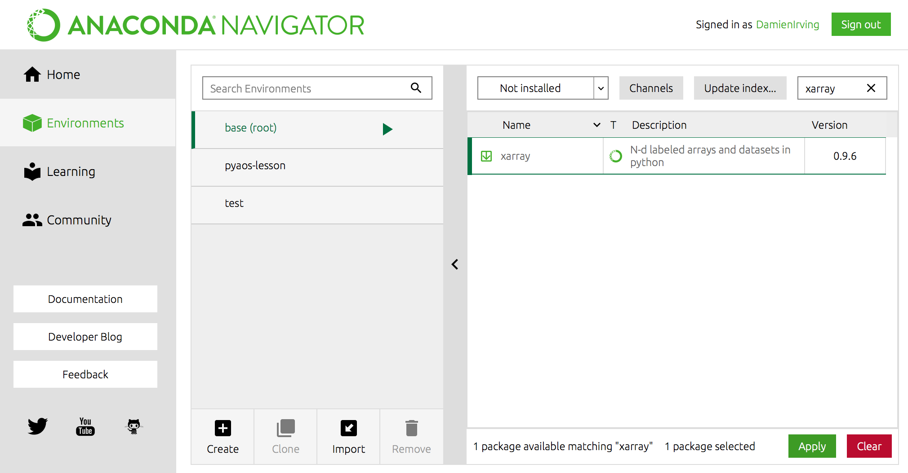

## Data

In preparation for these lessons,
you will need to download the following two Python scripts and four netCDF files
and place them in a new folder/directory:

1. Make a new folder in your Desktop called `data-carpentry`.
2. Download [script_template.py][template_script] and [plot_precipitation_climatology.py][precip_script] and move them into that folder.
3. Make a new folder in your `data_carpentry` folder called `data`.
   Download the following files and place them in that folder:
   - [pr_Amon_ACCESS1-3_historical_r1i1p1_200101-200512.nc][pr_access_file]
   - [pr_Amon_CSIRO-Mk3-6-0_historical_r1i1p1_200101-200512.nc][pr_csiro_file]
   - [sftlf_fx_ACCESS1-3_historical_r0i0p0.nc][sftlf_access_file]
   - [sftlf_fx_CSIRO-Mk3-6-0_historical_r0i0p0.nc][sftlf_csiro_file]

## Software installation

In order to complete the lessons,
you will need access to the following:

* The bash shell
* A text editor
* Git
* Anaconda (which is a Python distribution)

If you don't already have these installed,
please follow The Carpentries [software installation instructions](https://carpentries.github.io/workshop-template/#setup).
You do not need to install R, SQL or any of the additional software listed at that site.

> ## Troubeshooting
>
> If you have any trouble with software installation,
> The Carpentries maintain a list of common issues on their
> [Configuration Problems and Solutions wiki page](https://github.com/carpentries/workshop-template/wiki/Configuration-Problems-and-Solutions).
>
{: .callout}

Depending on time and wifi constraints,
your workshop instructor may also ask that you install the python packages introduced in the
[first lesson](https://carpentrieslab.github.io/python-aos-lesson/01-conda/index.html)
ahead of time.
You can do this via the command line or by using the Anaconda Navigator:

> ## Installation of python packages: via the command line
>
> (Windows users may need to open the Anaconda Prompt program
> and run `conda init bash` to make conda available at the Bash Shell.)
>
> The first step is to add the conda-forge channel:
> ~~~
> $ conda config --add channels conda-forge
> ~~~
> {: .language-bash}
>
> You can then install the packages in the base conda environment
> (recommended if you're new to using Anaconda):
> ~~~
> $ conda install jupyter xarray netCDF4 cartopy cmocean cmdline_provenance
> ~~~
> {: .language-bash}
>
> OR you can create a new environment called `pyaos-lesson`
> and install the packages there:
> ~~~
> $ conda create -n pyaos-lesson jupyter xarray netCDF4 cartopy cmocean cmdline_provenance
> ~~~
> {: .language-bash}
>
> You can activate this new environment as follows:
> ~~~
> $ conda activate pyaos-lesson
> ~~~
> {: .language-bash}
>
> (Or `source activate pyaos-lesson` if that doesn't work.)
>
> Type `conda deactivate` to exit that environment.
{: .solution}

> ## Installation of python packages: via the Anaconda Navigator
>
> Once you've opened the Anaconda Navigator program
> (which can be found at the Windows start menu),
> head to the "Environments" tab.
> 
> You can install the packages into the "base" environment
> (recommended if you're new to Anaconda)
> OR create a new environment called `pyaos-lesson`
> by clicking the "create" button at the bottom of the environment
> list before doing the following:
>
> **Step 1:** Add the `conda-forge` channel. 
> 
>
> **Step 2:** Install the `jupyter`, `xarray`, `netCDF4`, `cartopy`, `cmocean` and `cmdline_provenance`
> packages one-by-one (click "apply" to install once selected)
> 
{: .solution}

## Software check

To check that everything is installed correctly, follow the instructions below.

**Bash Shell**

* *Linux*: Open the Terminal program via the applications menu. The default shell is usually Bash. If you aren't sure what yours is, type `echo $SHELL`. If the shell listed is not bash, type `bash` and press Enter to access Bash.
* *Mac*: Open the Applications Folder, and in Utilities select Terminal.
* *Windows*: Open the Git Bash program via the Windows start menu.

**Git**

* At the Bash Shell, type `git --version`. You should see the version of your Git program listed. 

**Anaconda**

* At the Bash Shell, type `python --version`. You should see the version of your Python program listed, with a reference to Anaconda (i.e. the default Python program on your laptop needs to be the Anaconda installation of Python).

[pr_access_file]: {{ "/data/pr_Amon_ACCESS1-3_historical_r1i1p1_200101-200512.nc" | relative_url }}
[pr_csiro_file]: {{ "/data/pr_Amon_CSIRO-Mk3-6-0_historical_r1i1p1_200101-200512.nc" | relative_url }}
[sftlf_access_file]: {{"/data/sftlf_fx_ACCESS1-3_historical_r0i0p0.nc" | relative_url }}
[sftlf_csiro_file]: {{ "/data/sftlf_fx_CSIRO-Mk3-6-0_historical_r0i0p0.nc" | relative_url }}
[template_script]: {{ "/code/script_template.py" | relative_url }}
[precip_script]: {{ "code/plot_precipitation_climatology.py" | relative_url }}
