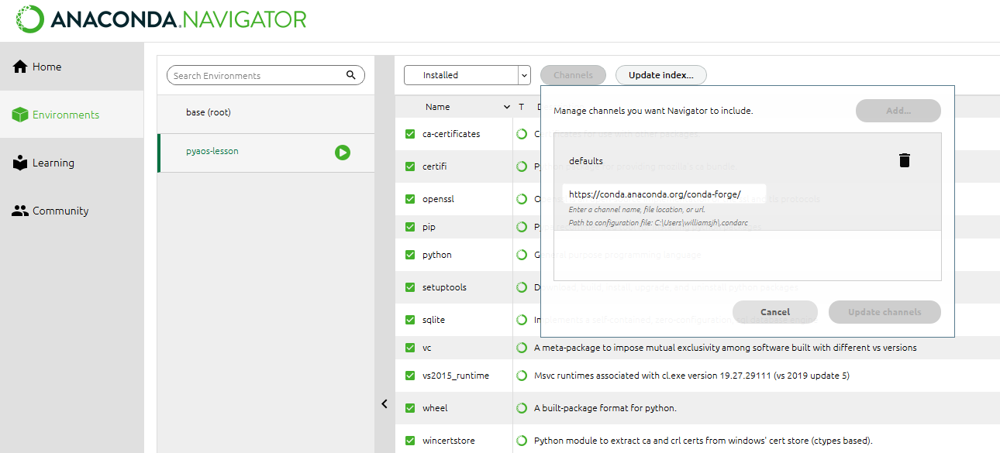

## Data

In preparation for this lesson,
you will need to download two Python scripts and four netCDF files and place them in a new folder/directory:

1. Make a new folder in your Desktop called `data-carpentry`.
2. Download [script_template.py][template_script] and [plot_precipitation_climatology.py][precip_script] and move them into that folder.
3. Make a new folder in your `data_carpentry` folder called `data`.
   Download the following files and place them in that folder:
   - [pr_Amon_ACCESS1-3_historical_r1i1p1_200101-200512.nc][pr_access_file]
   - [pr_Amon_CSIRO-Mk3-6-0_historical_r1i1p1_200101-200512.nc][pr_csiro_file]
   - [sftlf_fx_ACCESS1-3_historical_r0i0p0.nc][sftlf_access_file]
   - [sftlf_fx_CSIRO-Mk3-6-0_historical_r0i0p0.nc][sftlf_csiro_file]

## Software installation

If your instructor hasn't sent you instructions on how to install the required software,
follow the [default Carpentries instructions](https://carpentries.github.io/workshop-template/#setup).
You need to install the bash shell, git, text editor and Python.

Depending on time and wifi constraints,
your instructor may also ask that you install the python packages introduced in the
[first lesson](https://carpentrieslab.github.io/python-aos-lesson/01-conda/index.html)
ahead of time.
Your instructor will specify whether to do this following the default approach
or conda environments approach (see below for instructions).

> ## Installation of python packages: Linux & Mac (default)
>
> The required python packages can be installed at the bash shell as follows:
> ~~~
> $ conda config --add channels conda-forge
> $ conda install jupyter xarray netCDF4 cartopy cmocean
> ~~~
> {: .language-bash}
{: .solution}

> ## Installation of python packages: Windows (default)
>
> Python packages can be added to your base environment via the Anaconda Navigator
> (which can be found at the Windows start menu):
>
> **Step 1:** Add the `conda-forge` channel. 
> 
>
> **Step 2:** Install the `jupyter`, `xarray`, `netCDF4`, `cartopy` and `cmocean`
> packages one-by-one (click "apply" to install once selected)
> 
{: .solution}

> ## Installation of python packages: Linux & Mac (using conda environments)
>
> The required python packages can be installed in a new conda environment
> called `pyaos-lesson` by executing the following commands at the bash shell:
> ~~~
> $ conda config --add channels conda-forge
> $ conda create -n pyaos-lesson jupyter xarray netCDF4 cartopy cmocean
> ~~~
> {: .language-bash}
>
> You can activate this new environment as follows:
> ~~~
> $ conda activate pyaos-lesson
> ~~~
> {: .language-bash}
>
> (Or `source activate pyaos-lesson` if that doesn't work.)
>
> Type `conda deactivate` to exit that environment.
{: .solution}

> ## Installation of python packages: Windows (using conda environments and bash shell)
>
> The `conda` command is not automatically available using Git Bash.
> This means that Windows users cannot create and activate a conda environment from the bash shell,
> which is an option in the [first lesson](https://carpentrieslab.github.io/python-aos-lesson/01-conda/index.html).
> While this is not a big issue (the first lesson can be completed without creating a new environment),
> Windows users who would like to be able create and activate conda environments from the bash shell
> can do so by following one of these two options:
>
> **Option 1:** Access the bash shell from the Anaconda Prompt using the posix package
>
> * Open the Anaconda Prompt program (via the Windows start menu)
> * Type `conda install posix` (this only needs to be done once)
> * Type `bash` to run the Bash Shell
>
> **Option 2:** Update your Anaconda path so that `conda` is available using Git Bash
>
> * Open the Anaconda Prompt program (via the Windows start menu) and enter `where python` to find the path of the Anaconda3 directory (the output should show a path similar to `C:\Users\Username\Anaconda3\python.exe`)
> * Convert that path for use in the next step by doing the following:
>    * Replace all instances of `\` with `/`
>    * Replace `C:` with `/c`
>    * Replace `python.exe` with `Scripts/activate`
>    * e.g. if you got `C:\Users\Username\Anaconda3\python.exe` from the previous step, you will use `/c/Users/Username/Anaconda3/Scripts/activate` for the next step
> * Go back to the terminal and run `echo  "source [Anaconda path]" >> ~/.profile && source ~/.profile`, replacing `[Anaconda path]` with the path you generated in the previous step
>
> Once conda is available at the bash shell,
> the required python packages can be installed in a new conda environment
> called `pyaos-lesson` by executing the following commands:
> ~~~
> $ conda config --add channels conda-forge
> $ conda create -n pyaos-lesson jupyter xarray netCDF4 cartopy cmocean
> ~~~
> {: .language-bash}
>
> You can activate this new environment as follows:
> ~~~
> $ conda activate pyaos-lesson
> ~~~
> {: .language-bash}
>
> (Or `source activate pyaos-lesson` if that doesn't work.)
>
> Type `conda deactivate` to exit that environment.
{: .solution}

## Software check

To check that everything is installed correctly, follow the instructions below.

**Bash Shell**

* *Linux*: Open the Terminal program via the applications menu. The default shell is usually Bash. If you aren't sure what yours is, type `echo $SHELL`. If the shell listed is not bash, type `bash` and press Enter to access Bash.
* *Mac*: Open the Applications Folder, and in Utilities select Terminal.
* *Windows (default setup)*: Open the Git Bash program via the Windows start menu.

**Git**

* At the Bash Shell, type `git --version`. You should see the version of your Git program listed. 

**Anaconda**

* At the Bash Shell, type `python --version`. You should see the version of your Python program listed, with a reference to Anaconda (i.e. the default Python program on your laptop needs to be the Anaconda installation of Python).

[pr_access_file]: {{ "/data/pr_Amon_ACCESS1-3_historical_r1i1p1_200101-200512.nc" | relative_url }}
[pr_csiro_file]: {{ "/data/pr_Amon_CSIRO-Mk3-6-0_historical_r1i1p1_200101-200512.nc" | relative_url }}
[sftlf_access_file]: {{"/data/sftlf_fx_ACCESS1-3_historical_r0i0p0.nc" | relative_url }}
[sftlf_csiro_file]: {{ "/data/sftlf_fx_CSIRO-Mk3-6-0_historical_r0i0p0.nc" | relative_url }}
[template_script]: {{ "/code/script_template.py" | relative_url }}
[precip_script]: {{ "code/plot_precipitation_climatology.py" | relative_url }}
